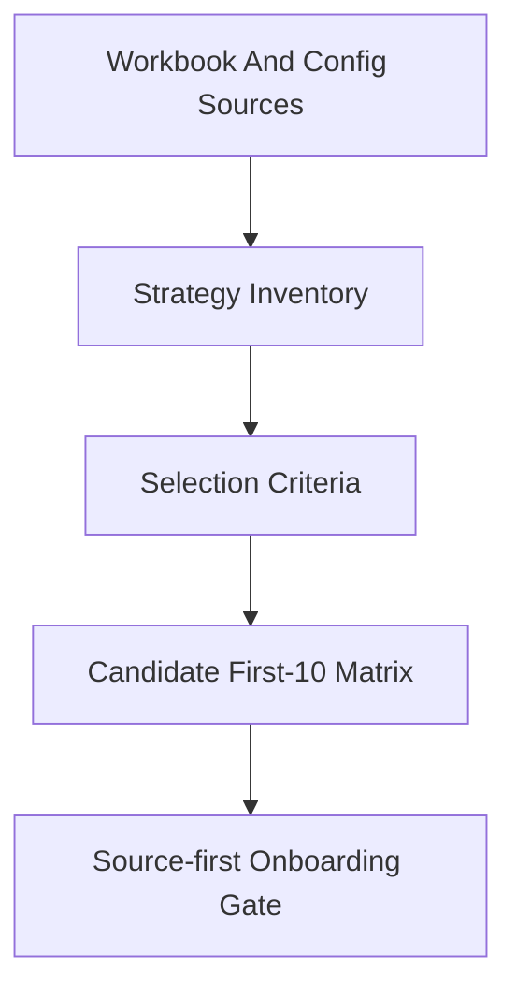
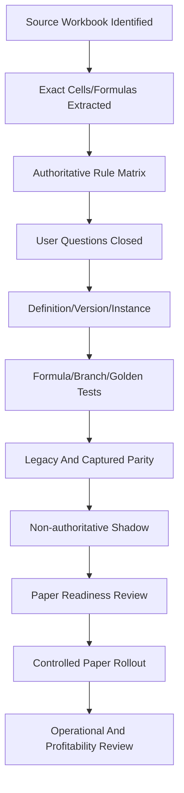
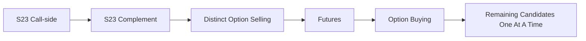
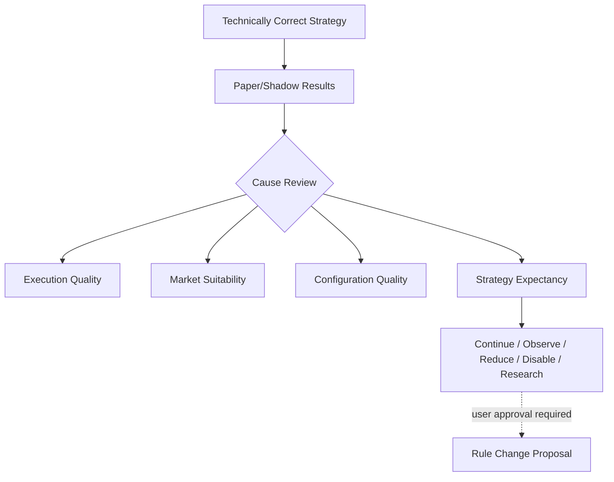

# TFIS First 10 Strategy Delivery Roadmap

Status: Phase 3E Milestone 1 draft.

Date: Friday, July 31, 2026

This document will become the first-10 strategy onboarding roadmap. Milestone 1
does not finalize the candidate list. It defines the selection method and the
initial inventory constraints.

## 1. Selection Objective

The first 10 strategies should validate the first complete TFIS system without
choosing strategies only because they are easy.

The set should collectively cover:

- Option Selling
- Option Buying
- Futures
- Call and Put
- Bull, Bull CF, Bear, Bear CF
- normal entry
- gap/recalculated entry
- carried positions
- same-reference and different-reference structures
- index and stock where practical
- near/next expiry behavior where applicable
- different Target/SL formula families

## 2. Current Inventory Observed In Refactored Repo

Implemented or configured today:

- `S23_NIFTY_OP_SELL_WK_DIFF_2D_3D`
- `S23_NIFTY_OP_SELL_WK_DIFF_2D_3D_BEAR_CALL`
- `S23_NIFTY_OP_SELL_WK_DIFF_2D_3D_BEAR_PUT`
- `S23_NIFTY_OP_SELL_WK_DIFF_2D_3D_BULL_PUT`
- `S21_BANKNIFTY_OP_SELL_MONTHLY_BULL_CALL`
- `S21_BANKNIFTY_OP_SELL_MONTHLY_BULL_PUT`
- `S21_BANKNIFTY_OP_SELL_MONTHLY_BEAR_CALL`
- `S21_BANKNIFTY_OP_SELL_MONTHLY_BEAR_PUT`

Family placeholders exist for:

- option buying
- futures
- equity

Authoritative workbook/source files observed:

- `TFISRulesAndSpec/AB6 Fut.xlsx`
- `TFISRulesAndSpec/AB7 OS.xlsx`
- `TFISRulesAndSpec/AB8 OB.xlsx`
- `TFISRulesAndSpec/AB9 Equity.xlsx`
- `TFISRulesAndSpec/All in One - TFIS 26-12-2023.xlsx`
- FTAS and Monthly Status specification PDFs

## 3. Candidate Selection Rules

Every candidate must pass these gates before onboarding:

1. workbook rule extraction
2. authoritative rule matrix row
3. normalized configuration definition and immutable version
4. explicit policy composition
5. formula/unit tests
6. synthetic golden fixtures
7. legacy fixture parity where a reference exists
8. captured/replay parity where evidence exists
9. non-authoritative shadow run
10. paper approval
11. controlled account rollout
12. operational acceptance

No strategy may be enabled merely because its configuration loads.

## 4. Initial Candidate Direction

The first candidate remains S23 Call-side because it has the deepest accepted
offline and runtime evidence.

The likely next candidates should come from:

- remaining S23 Put branches after resolving PUT authority gaps
- S21 BankNifty monthly option selling branches after source verification
- one Futures strategy from `AB6 Fut.xlsx`
- one Option Buying strategy from `AB8 OB.xlsx`
- one Equity strategy from `AB9 Equity.xlsx`

This is not final approval of the first-10 list. The final candidate matrix is
deferred to Phase 3E Milestone 4.

## 5. Milestone 1 Decisions

- Candidate selection must be coverage-driven, not ease-driven.
- S23 Call-side is first because it is already implemented offline and
  non-authoritatively at runtime.
- Option Buying, Futures, and Equity must not be claimed implementation-ready
  until workbook extraction and normalized configuration are complete.
- First-10 onboarding must stay source-first and evidence-driven.

## 6. Milestone 2 Ownership Gates For Strategy Onboarding

Phase 3E Milestone 2 adds ownership gates that every first-10 strategy must
pass before paper authority:

- each candidate must resolve to a unique `StrategyInstance`
- each candidate must declare the approved account/session scope
- each candidate must produce `ExecutionIntent` objects without broker-specific
  payloads
- fresh-entry and carried-position lifecycle requirements must reference a
  `PositionCycle`
- target, SL, FSL, TRP, MSL, expiry, square-off, and carry-forward requirements
  must be expressed as `LifecycleRequirement` / `ProtectionRequirement`
  records, not direct order mutation
- order/fill/position state must be traceable through account, strategy
  instance, trading session, position cycle, client order, broker order, and
  evidence packet identities
- onboarding cannot rely on strategy code plus symbol as the durable state key
- candidates with unresolved quantity/protection semantics remain blocked
  before paper authority

These gates do not change the first candidate direction. They prevent the
first-10 work from recreating one strategy-specific paper path per strategy.

## 7. Milestone 3 Recovery, Risk, And Performance Gates

Phase 3E Milestone 3 adds additional gates before a first-10 candidate can move
from offline/shadow into paper authority:

- strategy plans and evidence packets must be persisted as immutable facts
- every candidate must produce idempotent `ExecutionIntent` records
- order/fill/position projections must be recoverable after restart
- broker or paper truth must reconcile before resumed authority
- candidate lifecycle behavior must define protection status after restart,
  partial fill, cancel/replace, EOD, and next-day carried startup
- strategy-specific fresh entry must be separable from carried-position
  protection when global new entries are blocked
- strategy data requirements must fit the coherent snapshot policy
- ordinary quote/OI bursts may be conflated, but ORPT, RC, EOD, fills,
  reconciliation, and position transitions must be preserved
- candidate onboarding must define minimum observability: plan state, block
  reason, active cycle, order state, protection generation, and P&L source facts

These gates make S23 Call-side still the correct first implementation
candidate, because it has the deepest current offline evidence and already
exercises fresh-entry, gap, carried-position, and lifecycle paths.

## 8. Milestone 4 Strategy Inventory

The full machine-readable inventory is
`reports/phase3e/strategy_inventory.json`.

Observed implementation-ready strength:

- S23 NIFTY weekly option-selling Call-side has the strongest accepted
  supported scope.
- S23 Put-side configs exist, but Put-side vertical parity and carried-position
  activation evidence remain conditional.
- S21 BankNifty monthly option-selling scaffolds exist, but source rules,
  ORPT/RC applicability, carried behavior, and daily reference packets remain
  verification gates.
- Futures, Option Buying, and Equity family sources exist in `TFISRulesAndSpec`,
  but normalized implementation-ready strategy configs do not yet exist.

## 9. First-10 Selection Criteria

The scoring model uses:

- business variation coverage
- workbook verification completeness
- existing implementation reuse
- fixture/captured evidence availability
- product coverage
- branch and Call/Put coverage
- normal/gap and ORPT/RC coverage
- carried-position coverage
- expiry/contract-selection variation
- Target/SL/lifecycle variation
- operational risk
- implementation complexity
- architecture proof value

Hypothetical profitability is not a selection criterion unless reliable trade
evidence exists.

## 10. Candidate First-10 Set

The candidate matrix is
`reports/phase3e/first_10_strategy_candidate_matrix.json`.

Recommended candidate order:

1. S23 NIFTY Bull Call.
2. S23 NIFTY Bear Call.
3. S23 NIFTY Bull Put, conditional on Put source/parity closure.
4. S23 NIFTY Bear Put, conditional on Put source/parity closure.
5. S21 BankNifty monthly Bull Call, conditional on S21 source closure.
6. S21 BankNifty monthly Bear Put, conditional on S21 source closure.
7. One futures candidate from `AB6 Fut.xlsx`, conditional on extraction.
8. One option-buying candidate from `AB8 OB.xlsx`, conditional on extraction.
9. One equity candidate from `AB9 Equity.xlsx`, conditional on extraction.
10. One remaining S21 branch after the first S21 proof.

This is not final approval. It is the evidence-based candidate slate for the
next planning milestone.

## 11. Strategy Onboarding Gate

The machine-readable checklist is
`reports/phase3e/strategy_onboarding_gate.json`.

No strategy may skip source verification.

## 12. Strategy Scorecard

Each candidate must be scored separately on:

- source completeness
- formula coverage
- branch coverage
- fixture coverage
- captured evidence
- replay parity
- shadow parity
- runtime performance
- risk/control readiness
- recovery readiness
- analytics fact completeness
- paper result quality
- unresolved defects
- authority level

There is no single undifferentiated `READY` flag.

## 13. Onboarding Batch Size

Default: one strategy at a time through shadow and initial paper acceptance.

Family pairs may be batched only after the shared engine and one representative
strategy are already proven. This avoids converting family similarity into
hidden rule inference.

## 14. Profitability Review Gate

After a strategy is technically correct but unprofitable, TFIS must separate:

- implementation correctness
- execution quality
- market suitability
- configuration quality
- genuine strategy expectancy

Allowed outcomes:

- continue
- observe longer
- reduce paper allocation
- disable
- investigate execution
- investigate source/configuration
- propose research experiment
- require user approval before any rule change

