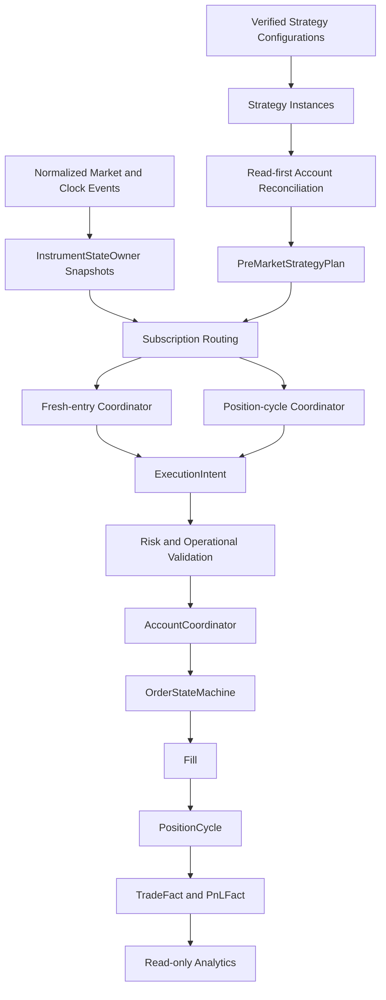

# TFIS Minimum Production Architecture V1

Status: Phase 3E Milestone 1 draft.

Date: Friday, July 31, 2026

Verdict: `MILESTONE_1_SCOPE_DRAFT`

This document defines the first complete TFIS system target. It is an
implementation roadmap, not production implementation approval. No broker,
paper, live, order mutation, or position mutation authority is granted by this
document.

## 1. Milestone 1 Scope

Milestone 1 covers:

- current-state verification
- mandatory capability classification
- explicit Version 1 success definition
- explicit Version 1 exclusions
- initial implementation gap matrix

Later Phase 3E milestones will complete ownership, account/order/position
architecture, persistence, recovery, analytics, first-10 strategy sequencing,
diagrams, and final certification.

## 2. Current Verified State

The accepted platform foundation includes:

- strategy family, definition, version, instance, evaluation, and position-cycle
  identity
- generic Business Engine Framework
- immutable runtime, decision, and evidence contracts
- S23 Call-side `PreMarketStrategyPlan`
- S23 Call-side `OpeningMarketContext`
- S23 Call-side `EffectiveExecutionPlan`
- S23 fresh-entry normal and gap/recalculation offline coordination
- S23 carried-position reconciliation snapshot and lifecycle context
- target-first carried-position opening handling
- ORPT Original-SL evaluation
- RC revised FSL/TRP calculation for verified S23 Call-side rules
- 15:00 square-off/carry decision with user-clarified equality carry-forward
- deterministic offline carried-position day coordination
- M15 normalized runtime events, instrument snapshots, subscription routing,
  stream coordinators, in-memory replay/resume, and quote conflation

Authority remains:

- broker authority: `NONE`
- paper authority: `NONE`
- live authority: `NONE`
- order mutation authority: `NONE`
- position mutation authority: `NONE`

## 3. Version 1 Success Definition

The first successful end-to-end TFIS system is a safe paper-authorized system
that can run a small approved portfolio of source-verified strategies through
the complete operational path:

```text
verified configuration
-> strategy instance resolution
-> account reconciliation
-> pre-market planning
-> market/clock event coordination
-> fresh-entry or carried-position evaluation
-> execution intent
-> risk and operational validation
-> account authorization
-> broker-neutral order request
-> paper or broker adapter boundary
-> order state tracking
-> fill tracking
-> position-cycle lifecycle
-> EOD/carry-forward decision
-> restart recovery
-> realized/unrealized P&L
-> decision, execution, reconciliation, and analytics evidence
```

Version 1 must support:

- verified strategy configurations
- enabled strategy-instance resolution
- multiple logical broker accounts
- account orders and positions reconciliation
- pre-market plans
- normalized market and clock events
- fresh-entry normal and gap paths
- carried-position paths
- execution intents
- risk and operational validation
- account-specific execution routing
- order and fill tracking
- position cycles
- target, Original SL, revised SL, EOD, and carry-forward requirements
- safe restart and recovery
- realized and unrealized P&L
- complete decision and execution evidence
- essential operational and profitability analytics

## 4. What End To End Does Not Include In Version 1

Version 1 does not include:

- live-money order authority
- automated broker write routing before separate live gates
- distributed microservices
- Kafka or external event brokers
- multi-tenant SaaS infrastructure
- advanced portfolio optimization
- AI trade diagnosis
- machine-learning strategy ranking
- natural-language analytics
- full analytical warehouse
- automated strategy modification
- unverified strategy rules

## 5. Mandatory Capability Categories

Every capability in Phase 3E must use exactly one category:

- `REQUIRED_FOR_FIRST_END_TO_END_SYSTEM`
- `REQUIRED_BEFORE_PAPER_AUTHORITY`
- `REQUIRED_BEFORE_LIVE_AUTHORITY`
- `DEFERRED_EXTENSION`

No vague capability category is allowed.

## 6. Version 1 Architecture Sketch



## 7. Truth Hierarchy For Version 1

The Version 1 truth hierarchy is:

```text
Market truth
-> Business-decision truth
-> Execution-intent truth
-> Broker-order truth
-> Position truth
-> Accounting/P&L truth
-> Analytical projection truth
```

Rules:

- analytics never mutates trading authority
- broker truth must be reconciled before local action
- no order or position may be identified only by strategy code or symbol
- no two components may independently mutate one order or position cycle

## 8. Initial Capability Classification

The initial classification is recorded in
`reports/phase3e/minimum_production_gap_matrix.json`.

High-level Milestone 1 decisions:

| Capability group | Category |
| --- | --- |
| Strategy identity/configuration | `REQUIRED_FOR_FIRST_END_TO_END_SYSTEM` |
| M15 runtime coordination | `REQUIRED_FOR_FIRST_END_TO_END_SYSTEM` |
| Read-first broker reconciliation | `REQUIRED_FOR_FIRST_END_TO_END_SYSTEM` |
| ExecutionIntent boundary | `REQUIRED_FOR_FIRST_END_TO_END_SYSTEM` |
| Risk and operational validation | `REQUIRED_FOR_FIRST_END_TO_END_SYSTEM` |
| AccountCoordinator | `REQUIRED_BEFORE_PAPER_AUTHORITY` |
| OrderStateMachine | `REQUIRED_BEFORE_PAPER_AUTHORITY` |
| PositionCycle execution integration | `REQUIRED_BEFORE_PAPER_AUTHORITY` |
| Reliable persistence and recovery | `REQUIRED_BEFORE_PAPER_AUTHORITY` |
| Essential P&L facts | `REQUIRED_BEFORE_PAPER_AUTHORITY` |
| Live broker write enablement | `REQUIRED_BEFORE_LIVE_AUTHORITY` |
| Advanced analytics and AI | `DEFERRED_EXTENSION` |

## 9. Milestone 1 Source Gaps

- The first-10 strategy list cannot be final until the strategy inventory is
  reviewed against workbook source and user approval.
- Option Buying, Futures, and Equity source sheets exist in
  `TFISRulesAndSpec`, but their implementation-ready normalized configs are
  not yet present in the refactored strategy registry.
- Existing paper lifecycle, order, reconciliation, and persistence code exists
  as useful reference, but must be reviewed in later milestones before being
  promoted into the new V1 architecture.
- No production persistence architecture is approved yet.
- No paper or live authority is approved.

## 10. Milestone 1 Acceptance Gate

Milestone 1 is acceptable when:

- current accepted state is verified
- Version 1 success and exclusions are explicit
- every initial capability has a mandatory category
- initial gap matrix exists and is JSON-valid
- no production code changes are made
- runtime/broker/paper/live authority remains `NONE`
