# TFIS Minimum Production Architecture V1

Status: Phase 3E Milestone 1 draft.

Date: Friday, July 31, 2026

Verdict: `MILESTONE_1_SCOPE_DRAFT`

This document defines the first complete TFIS system target. It is an
implementation roadmap, not production implementation approval. No broker,
paper, live, order mutation, or position mutation authority is granted by this
document.

## 1. Milestone 1 Scope

Milestone 1 covers:

- current-state verification
- mandatory capability classification
- explicit Version 1 success definition
- explicit Version 1 exclusions
- initial implementation gap matrix

Later Phase 3E milestones will complete ownership, account/order/position
architecture, persistence, recovery, analytics, first-10 strategy sequencing,
diagrams, and final certification.

## 2. Current Verified State

The accepted platform foundation includes:

- strategy family, definition, version, instance, evaluation, and position-cycle
  identity
- generic Business Engine Framework
- immutable runtime, decision, and evidence contracts
- S23 Call-side `PreMarketStrategyPlan`
- S23 Call-side `OpeningMarketContext`
- S23 Call-side `EffectiveExecutionPlan`
- S23 fresh-entry normal and gap/recalculation offline coordination
- S23 carried-position reconciliation snapshot and lifecycle context
- target-first carried-position opening handling
- ORPT Original-SL evaluation
- RC revised FSL/TRP calculation for verified S23 Call-side rules
- 15:00 square-off/carry decision with user-clarified equality carry-forward
- deterministic offline carried-position day coordination
- M15 normalized runtime events, instrument snapshots, subscription routing,
  stream coordinators, in-memory replay/resume, and quote conflation

Authority remains:

- broker authority: `NONE`
- paper authority: `NONE`
- live authority: `NONE`
- order mutation authority: `NONE`
- position mutation authority: `NONE`

## 3. Version 1 Success Definition

The first successful end-to-end TFIS system is a safe paper-authorized system
that can run a small approved portfolio of source-verified strategies through
the complete operational path:

```text
verified configuration
-> strategy instance resolution
-> account reconciliation
-> pre-market planning
-> market/clock event coordination
-> fresh-entry or carried-position evaluation
-> execution intent
-> risk and operational validation
-> account authorization
-> broker-neutral order request
-> paper or broker adapter boundary
-> order state tracking
-> fill tracking
-> position-cycle lifecycle
-> EOD/carry-forward decision
-> restart recovery
-> realized/unrealized P&L
-> decision, execution, reconciliation, and analytics evidence
```

Version 1 must support:

- verified strategy configurations
- enabled strategy-instance resolution
- multiple logical broker accounts
- account orders and positions reconciliation
- pre-market plans
- normalized market and clock events
- fresh-entry normal and gap paths
- carried-position paths
- execution intents
- risk and operational validation
- account-specific execution routing
- order and fill tracking
- position cycles
- target, Original SL, revised SL, EOD, and carry-forward requirements
- safe restart and recovery
- realized and unrealized P&L
- complete decision and execution evidence
- essential operational and profitability analytics

## 4. What End To End Does Not Include In Version 1

Version 1 does not include:

- live-money order authority
- automated broker write routing before separate live gates
- distributed microservices
- Kafka or external event brokers
- multi-tenant SaaS infrastructure
- advanced portfolio optimization
- AI trade diagnosis
- machine-learning strategy ranking
- natural-language analytics
- full analytical warehouse
- automated strategy modification
- unverified strategy rules

## 5. Mandatory Capability Categories

Every capability in Phase 3E must use exactly one category:

- `REQUIRED_FOR_FIRST_END_TO_END_SYSTEM`
- `REQUIRED_BEFORE_PAPER_AUTHORITY`
- `REQUIRED_BEFORE_LIVE_AUTHORITY`
- `DEFERRED_EXTENSION`

No vague capability category is allowed.

## 6. Version 1 Architecture Sketch

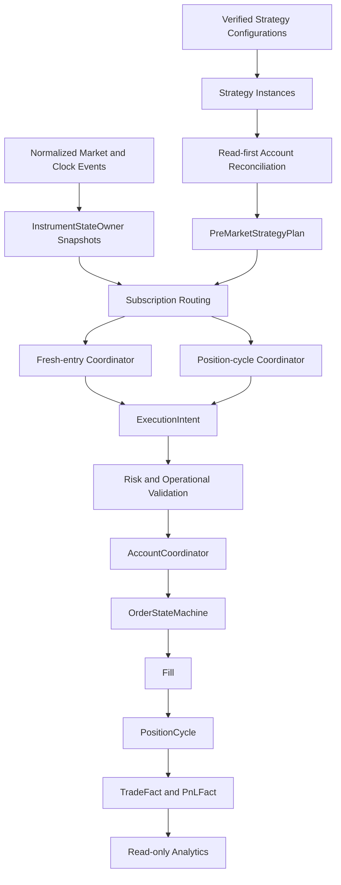

## 7. Truth Hierarchy For Version 1

The Version 1 truth hierarchy is:

```text
Market truth
-> Business-decision truth
-> Execution-intent truth
-> Broker-order truth
-> Position truth
-> Accounting/P&L truth
-> Analytical projection truth
```

Rules:

- analytics never mutates trading authority
- broker truth must be reconciled before local action
- no order or position may be identified only by strategy code or symbol
- no two components may independently mutate one order or position cycle

## 8. Initial Capability Classification

The initial classification is recorded in
`reports/phase3e/minimum_production_gap_matrix.json`.

High-level Milestone 1 decisions:

| Capability group | Category |
| --- | --- |
| Strategy identity/configuration | `REQUIRED_FOR_FIRST_END_TO_END_SYSTEM` |
| M15 runtime coordination | `REQUIRED_FOR_FIRST_END_TO_END_SYSTEM` |
| Read-first broker reconciliation | `REQUIRED_FOR_FIRST_END_TO_END_SYSTEM` |
| ExecutionIntent boundary | `REQUIRED_FOR_FIRST_END_TO_END_SYSTEM` |
| Risk and operational validation | `REQUIRED_FOR_FIRST_END_TO_END_SYSTEM` |
| AccountCoordinator | `REQUIRED_BEFORE_PAPER_AUTHORITY` |
| OrderStateMachine | `REQUIRED_BEFORE_PAPER_AUTHORITY` |
| PositionCycle execution integration | `REQUIRED_BEFORE_PAPER_AUTHORITY` |
| Reliable persistence and recovery | `REQUIRED_BEFORE_PAPER_AUTHORITY` |
| Essential P&L facts | `REQUIRED_BEFORE_PAPER_AUTHORITY` |
| Live broker write enablement | `REQUIRED_BEFORE_LIVE_AUTHORITY` |
| Advanced analytics and AI | `DEFERRED_EXTENSION` |

## 9. Milestone 1 Source Gaps

- The first-10 strategy list cannot be final until the strategy inventory is
  reviewed against workbook source and user approval.
- Option Buying, Futures, and Equity source sheets exist in
  `TFISRulesAndSpec`, but their implementation-ready normalized configs are
  not yet present in the refactored strategy registry.
- Existing paper lifecycle, order, reconciliation, and persistence code exists
  as useful reference, but must be reviewed in later milestones before being
  promoted into the new V1 architecture.
- No production persistence architecture is approved yet.
- No paper or live authority is approved.

## 10. Milestone 1 Acceptance Gate

Milestone 1 is acceptable when:

- current accepted state is verified
- Version 1 success and exclusions are explicit
- every initial capability has a mandatory category
- initial gap matrix exists and is JSON-valid
- no production code changes are made
- runtime/broker/paper/live authority remains `NONE`

## 11. Milestone 2 Domain Ownership Model

Status: Phase 3E Milestone 2 architecture/specification.

Milestone 2 defines the minimum production-grade ownership model needed before
TFIS can safely move from offline decision packets into paper-authorized order,
fill, and position-cycle tracking. It is still specification-only. It does not
grant broker, paper, live, order mutation, position mutation, persistence, or
execution authority.

### 11.1 Current Ownership Audit

The current refactored branch already has useful ingredients:

- strategy family, definition, version, instance, evaluation, and
  position-cycle identity contracts exist in `src/tfis/domain/strategy_identity.py`
- deterministic M15 runtime coordination provides in-memory single-writer
  instrument snapshots and subscription routing
- legacy paper order and position modules contain practical state and artifact
  patterns, but remain shaped by the earlier S23 paper path
- broker reconciliation helpers are read-first and useful, but current
  reconciliation keys are too coarse for V1 because provider and symbol are not
  enough to isolate account, strategy instance, position cycle, order purpose,
  and lifecycle generation

Milestone 2 therefore makes the ownership model explicit before reusing or
lifting those pieces.

### 11.2 Minimum Domain Entities

The detailed catalog is recorded in
`reports/phase3e/domain_ownership_catalog.json`.

| Entity | Purpose | Owner | Mutable | V1 category |
| --- | --- | --- | --- | --- |
| `BrokerAccountIdentity` | stable logical account key | account registry | no | `REQUIRED_FOR_FIRST_END_TO_END_SYSTEM` |
| `AccountSession` | one trading-day view of an account | `AccountCoordinator` | yes | `REQUIRED_BEFORE_PAPER_AUTHORITY` |
| `StrategyInstance` | enabled strategy/config binding | strategy resolver | no | `REQUIRED_FOR_FIRST_END_TO_END_SYSTEM` |
| `TradingSession` | date/session/time-zone boundary | runtime coordinator | no | `REQUIRED_FOR_FIRST_END_TO_END_SYSTEM` |
| `EffectiveExecutionPlan` | business plan before execution validation | business pipeline | no | `REQUIRED_FOR_FIRST_END_TO_END_SYSTEM` |
| `LifecycleRequirement` | required lifecycle protection or exit | lifecycle coordinator | no | `REQUIRED_BEFORE_PAPER_AUTHORITY` |
| `ExecutionIntent` | broker-neutral request candidate | execution-intent boundary | no | `REQUIRED_FOR_FIRST_END_TO_END_SYSTEM` |
| `ClientOrderIdentity` | TFIS-generated idempotency key | `AccountCoordinator` | no | `REQUIRED_BEFORE_PAPER_AUTHORITY` |
| `BrokerOrderIdentity` | adapter-reported order identity | broker adapter boundary | no | `REQUIRED_BEFORE_LIVE_AUTHORITY` |
| `BrokerOrder` | local projection of external order truth | `OrderStateMachine` | yes | `REQUIRED_BEFORE_PAPER_AUTHORITY` |
| `OrderEvent` | immutable order transition evidence | `OrderStateMachine` | no | `REQUIRED_BEFORE_PAPER_AUTHORITY` |
| `Fill` | immutable execution quantity/price fact | `OrderStateMachine` | no | `REQUIRED_BEFORE_PAPER_AUTHORITY` |
| `PositionCycle` | lifecycle of one trade idea/position | `PositionCycleCoordinator` | yes | `REQUIRED_BEFORE_PAPER_AUTHORITY` |
| `PositionQuantitySlice` | quantity accounting projection | `PositionCycleCoordinator` | yes | `REQUIRED_BEFORE_PAPER_AUTHORITY` |
| `ProtectionRequirement` | target/SL/FSL/TRP/MSL need | lifecycle coordinator | no | `REQUIRED_BEFORE_PAPER_AUTHORITY` |
| `ReconciliationResult` | broker/local/account comparison | `AccountCoordinator` | no | `REQUIRED_BEFORE_PAPER_AUTHORITY` |
| `RiskDecision` | per-intent risk approval/rejection | risk validator | no | `REQUIRED_BEFORE_PAPER_AUTHORITY` |
| `PortfolioControlDecision` | account/portfolio operational gate | portfolio supervisor | no | `REQUIRED_BEFORE_PAPER_AUTHORITY` |
| `TradeFact` | durable business event fact | analytics projection | no | `REQUIRED_BEFORE_PAPER_AUTHORITY` |
| `PnLFact` | realized/unrealized P&L fact | analytics projection | no | `REQUIRED_BEFORE_PAPER_AUTHORITY` |

### 11.3 Identity Traceability Chain

No V1 order, fill, position, protection, or P&L record may be keyed by strategy
code or symbol alone. The minimum chain is:

```text
BrokerAccountIdentity
-> AccountSession
-> TradingSession
-> StrategyInstance
-> StrategyDefinitionVersion
-> StrategyEvaluationIdentity
-> PositionCycleIdentity
-> EffectiveExecutionPlan
-> LifecycleRequirement or fresh-entry requirement
-> ExecutionIntent
-> ClientOrderIdentity
-> BrokerOrderIdentity
-> OrderEvent
-> Fill
-> PositionCycle
-> TradeFact
-> PnLFact
```

Every generated artifact must preserve enough of this chain to answer:

- which account owned the authority boundary
- which strategy instance produced the business requirement
- which trading session created the decision
- which position cycle was changed or protected
- which execution intent produced each order
- which broker or paper identity confirmed each order and fill
- which facts were derived from business truth, broker truth, or analytics truth

### 11.4 Truth And Ownership Hierarchy

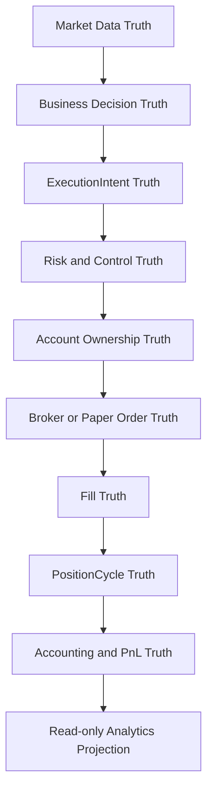

Rules:

- market data can invalidate a decision, but cannot create order authority by
  itself
- business decisions create requirements, not broker calls
- `ExecutionIntent` is the only bridge from business requirement to account
  validation
- broker or paper order truth must be reconciled before local state advances
- analytics is downstream only

### 11.5 Ownership Hierarchy

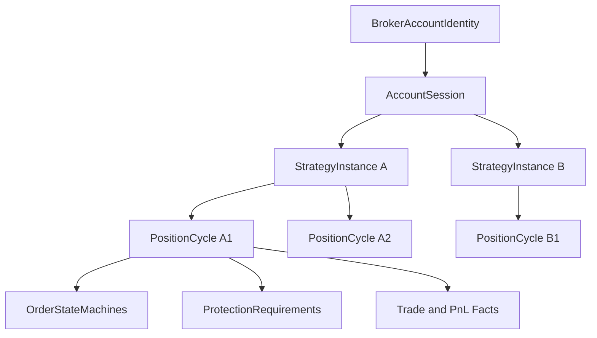

Minimum ownership rule:

- `AccountCoordinator` owns account-level acceptance and account-session
  isolation
- `OrderStateMachine` owns one client order
- `PositionCycleCoordinator` owns one position cycle
- `PortfolioRiskAndControlSupervisor` owns cross-strategy/account blocking
  decisions
- no component may mutate a child entity it does not own

### 11.6 AccountCoordinator

The `AccountCoordinator` is not a giant order manager. It is the account-level
authority gate and dispatcher.

Responsibilities:

- load account session policy
- verify account/session/strategy enablement
- consume read-first reconciliation results
- accept or reject validated `ExecutionIntent` objects
- allocate `ClientOrderIdentity`
- route accepted intents to the correct order-state owner
- isolate one account from another
- publish account-level evidence and rejection outcomes

It does not:

- calculate strategy rules
- rewrite entry, target, SL, or lifecycle formulas
- call broker SDKs directly
- own position-cycle business policy
- merge positions across accounts

### 11.7 EffectiveExecutionPlan To ExecutionIntent To BrokerOrder

```mermaid
flowchart LR
    Plan[EffectiveExecutionPlan] --> Validate[Intent Validation Pipeline]
    Validate --> Intent[ExecutionIntent]
    Intent --> Account[AccountCoordinator]
    Account --> ClientId[ClientOrderIdentity]
    ClientId --> OSM[OrderStateMachine]
    OSM --> Adapter[Broker or Paper Adapter Boundary]
    Adapter --> BrokerId[BrokerOrderIdentity]
    BrokerId --> BrokerOrder[BrokerOrder Projection]
```

The `ExecutionIntent` contract must be immutable, broker-neutral, and directly
usable by the next vertical slice.

Minimum fields:

- account identity
- trading session identity
- strategy instance and version identity
- position cycle identity or instruction to create one
- source requirement id
- order purpose
- instrument and contract identity
- side, option side where applicable, quantity, price policy, validity policy
- required protection linkage if this is an exit/protection order
- evidence packet hash
- idempotency key seed
- requested authority mode: offline, shadow, paper, or live

Forbidden fields:

- broker SDK objects
- raw broker-specific payloads
- mutable position objects
- strategy-specific string formulas
- implicit strategy-code/symbol-only keys

### 11.8 Intent Validation Pipeline

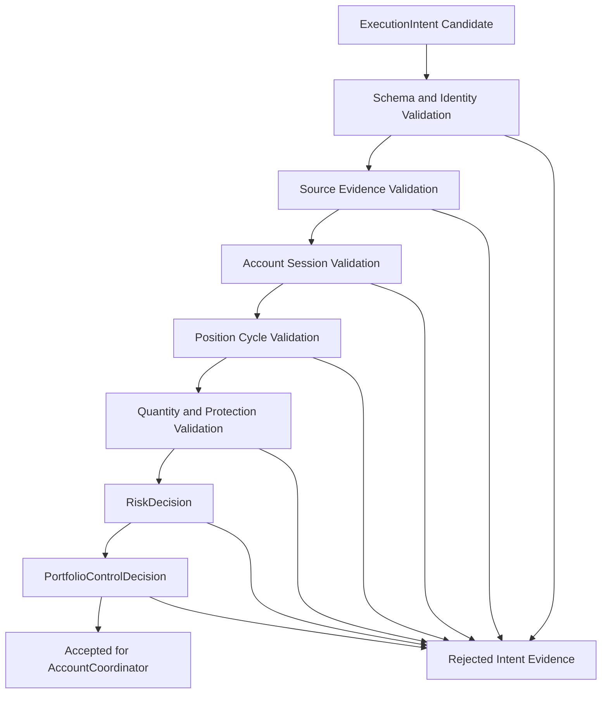

Rejection outcomes must be explicit:

- `INVALID_IDENTITY`
- `MISSING_SOURCE_EVIDENCE`
- `ACCOUNT_DISABLED`
- `STRATEGY_INSTANCE_DISABLED`
- `STALE_TRADING_SESSION`
- `POSITION_CYCLE_CONFLICT`
- `QUANTITY_INVARIANT_VIOLATION`
- `PROTECTION_INVARIANT_VIOLATION`
- `RISK_REJECTED`
- `PORTFOLIO_CONTROL_REJECTED`
- `AUTHORITY_MODE_NOT_APPROVED`
- `BROKER_CAPABILITY_UNAVAILABLE`

### 11.9 OrderStateMachine

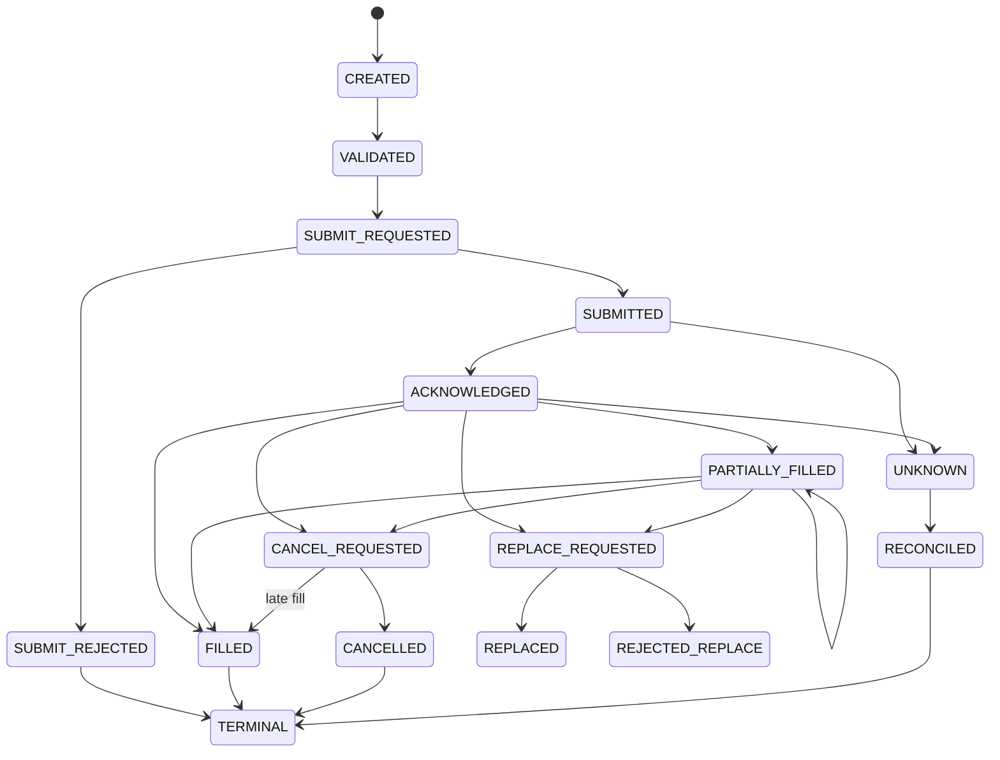

One order state machine owns one `ClientOrderIdentity`. It may attach a
`BrokerOrderIdentity` after adapter acknowledgement, but the client identity
remains the TFIS idempotency anchor.

Required edge-case handling:

- duplicate submit acknowledgement is idempotent
- partial fill before acknowledgement must be reconciled, not dropped
- fill after cancel request may still reduce remaining quantity
- cancel rejection leaves the order active unless broker truth says otherwise
- replace creates a new protection generation but must preserve old-order
  reconciliation until cancel/replace completion is proven
- unknown broker state blocks new dependent orders unless policy explicitly
  allows fail-closed replacement

### 11.10 Order Purpose And Replacement Rules

Order purpose must be typed. Minimum V1 purposes:

- `FRESH_ENTRY`
- `CARRIED_TARGET_EXIT`
- `CARRIED_ORIGINAL_SL`
- `CARRIED_REVISED_FSL`
- `CARRIED_REVISED_TRP`
- `TARGET_EXIT`
- `STOP_LOSS_EXIT`
- `EOD_SQUARE_OFF`
- `EXPIRY_FORCE_CLOSE`
- `MANUAL_OPERATOR_CLOSE`
- `PROTECTION_REPLACEMENT`

Replacement rules:

- a replacement cannot change account, strategy instance, or position cycle
- protection replacement must increment protection generation
- old and replacement orders must not jointly protect more quantity than the
  remaining open quantity unless the broker provides proven OCO semantics
- replacement rejection must leave the previous effective protection state
  visible
- stale replacement events cannot overwrite a newer protection generation

### 11.11 Fill Model

A `Fill` is immutable execution evidence. Minimum fields:

- account identity
- trading session identity
- client order identity
- broker order identity when available
- broker fill id when available
- position cycle identity
- instrument/contract identity
- side, quantity, price, fees/taxes where available
- event timestamp and broker timestamp
- source adapter
- reconciliation status

Fills mutate position-cycle projections only through the
`PositionCycleCoordinator`.

### 11.12 PositionCycle Architecture

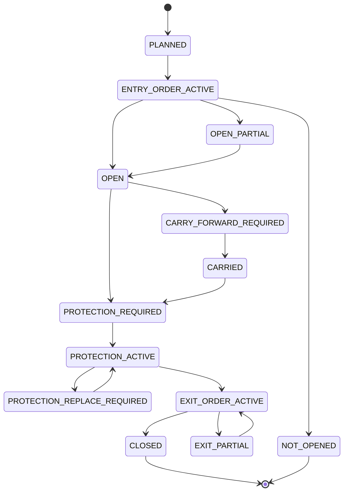

A position cycle represents one trade idea and its lifecycle, not one broker
order. One cycle may have:

- one or more entry orders
- zero or more partial fills
- multiple protection orders over time
- target exits
- stop-loss exits
- EOD square-off or carry-forward decisions
- recovery and reconciliation events

### 11.13 PositionQuantitySlice Decision

V1 should use aggregate remaining quantity plus ordered fill facts and
protection-generation records as the minimum reliable model. Explicit
lot-by-lot `PositionQuantitySlice` ownership is deferred until a source-verified
strategy requires different lifecycle policy for different filled lots.

Reason:

- the first paper-authorized system needs to prevent over-exit and
  under-protection before it needs per-lot analytics
- aggregate quantity plus fill facts can handle partial fills, partial exits,
  protection resizing, and realized P&L
- explicit slices add complexity and concurrency surface without a confirmed
  first-10 requirement

The architecture still names `PositionQuantitySlice` because the projection is
needed. In V1, it is a derived accounting projection, not an independently
mutable child object.

### 11.14 Partial Fill And Protection Resize

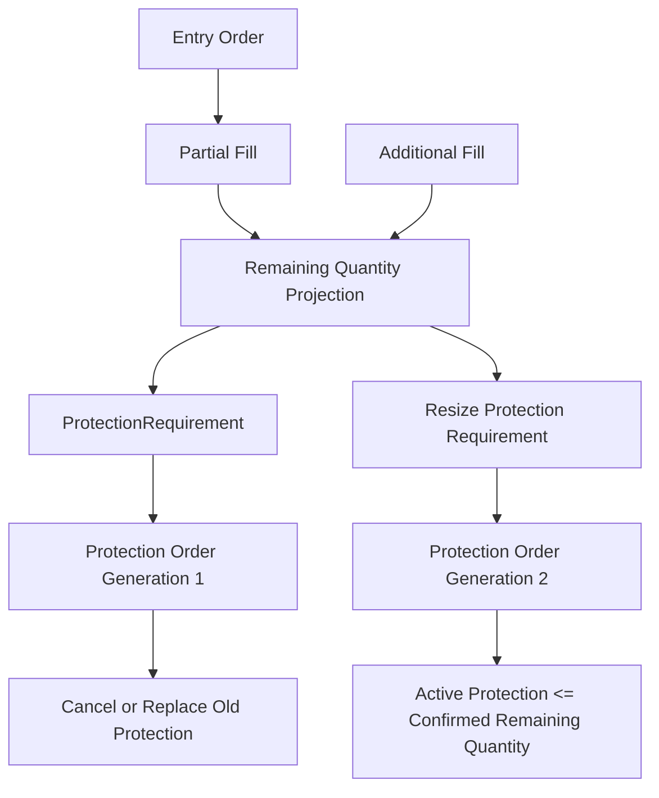

Rule: protection quantity may never exceed confirmed remaining quantity unless
the account coordinator has broker-proven OCO semantics and records the
exception as evidence.

### 11.15 LifecycleRequirement Boundary

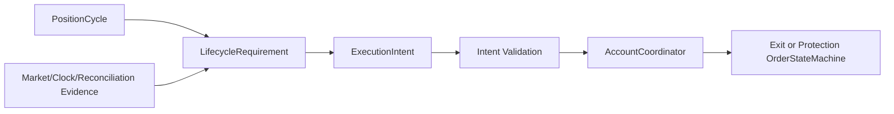

`LifecycleRequirement` is the lifecycle equivalent of an execution plan. It can
state that protection, revision, exit, square-off, or carry-forward is required,
but it does not place, modify, cancel, or mutate positions.

Minimum requirement types:

- `TARGET_PROTECTION_REQUIRED`
- `TARGET_EXIT_REQUIRED`
- `ORIGINAL_SL_PLACEMENT_REQUIRED`
- `REVISED_SL_PLACEMENT_REQUIRED`
- `REVISED_TRP_PLACEMENT_REQUIRED`
- `EOD_SQUARE_OFF_REQUIRED`
- `CARRY_FORWARD_REQUIRED`
- `EXPIRY_FORCE_CLOSE_REQUIRED`
- `NO_ACTION_REQUIRED`
- `RULE_AUTHORITY_UNRESOLVED`

### 11.16 Multiple Orders Per Position

A position cycle may own many order state machines. They are grouped by
purpose, generation, and remaining quantity.

Minimum rules:

- one active entry generation at a time unless strategy policy explicitly
  permits pyramiding
- target and SL protection must be linked to the same position-cycle generation
- exit orders reduce remaining quantity only after fill evidence
- multiple active exit orders must be quantity-capped
- stale exit/protection events cannot close a cycle after a newer reconciliation
  proves a different broker truth

### 11.17 Multiple Positions Per Strategy And Account

V1 must allow multiple position cycles per strategy instance and account, but
must default to conservative admission:

- one active fresh-entry cycle per strategy instance/product/underlying unless
  configuration explicitly allows concurrent cycles
- carried-position cycles remain separate from new fresh-entry cycles
- re-entry creates a new cycle unless an authoritative source rule says to
  extend the existing cycle
- account-level exposure checks must see all cycles for the account before
  accepting another intent

### 11.18 Multiple Account Isolation

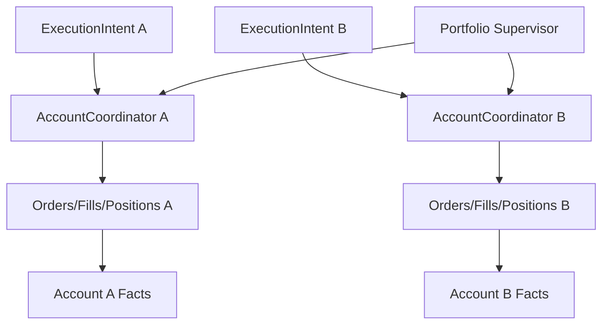

Rules:

- one account failure cannot mutate another account
- account-specific reconciliation blocks only that account unless the portfolio
  supervisor escalates a global halt
- client order identity must include account/session scope
- broker order identity is never globally unique unless the adapter proves it

### 11.19 Event Serialization And Concurrency

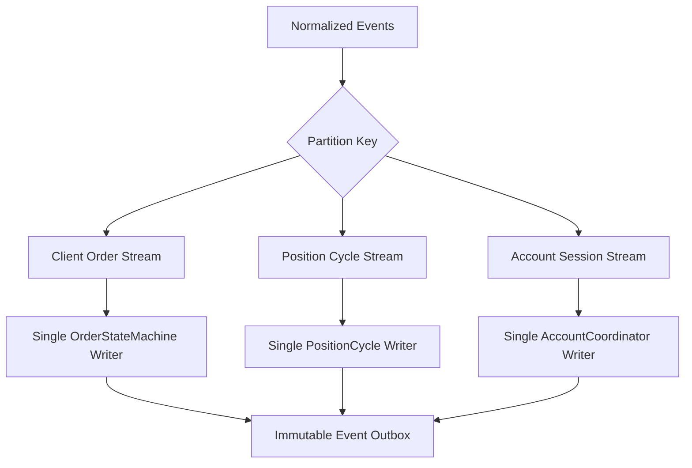

Minimum concurrency rule:

- per-entity updates are serialized by entity identity
- cross-entity workflows are coordinated through immutable events
- no shared mutable ownership between order and position owners
- derived read models may lag, but authority decisions must consume owner truth

### 11.20 Failure Isolation

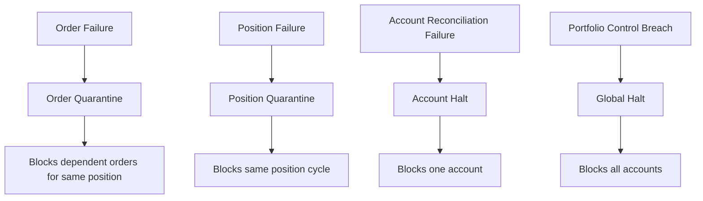

Failure scope should be the smallest safe scope:

- malformed intent: reject only that intent
- unknown order state: block dependent orders for that order/position
- reconciliation mismatch: block that account session
- strategy-rule unresolved: block affected strategy instance/cycle
- portfolio kill switch: block all account coordinators

### 11.21 Recovery Implications

Milestone 2 does not design the database, but it defines what recovery must
reconstruct:

- account sessions and last reconciliation result
- open order state machines by client order identity
- broker order identities and latest broker truth
- fills not yet projected into position cycles
- open and carried position cycles
- active protection generations
- pending lifecycle requirements
- rejected intents and unresolved authority blockers
- immutable trade and P&L fact projections

Recovery must replay facts into owners before accepting new intents.

### 11.22 Analytics Fact Connectivity

`TradeFact` and `PnLFact` are read-only downstream facts. They connect order,
fill, and position-cycle truth to analytics without granting trading authority.

Minimum facts:

- intent accepted/rejected
- order submitted/acknowledged/rejected/cancelled/replaced
- fill received
- position opened/partially opened/closed/partially closed
- target protection active
- SL/FSL/TRP protection active or missing
- EOD square-off or carry-forward decision
- realized and unrealized P&L snapshot

### 11.23 Invariants

The detailed invariant catalog is recorded in
`reports/phase3e/order_position_invariants.json`.

High-risk invariants:

- no exit or protection quantity may exceed confirmed remaining quantity
- no protection may exist for unfilled quantity
- one owner writes one order
- one owner writes one position cycle
- stale events cannot overwrite newer reconciliation truth
- closed cycles cannot accept new fills or protections except through explicit
  reconciliation correction
- broker or paper truth is read before local action
- analytics cannot drive order or position mutation

### 11.24 PortfolioRiskAndControlSupervisor

The portfolio supervisor is the cross-account control layer. It consumes
validated intents, account exposures, open cycles, pending orders, kill-switch
state, and operational readiness. It produces immutable
`PortfolioControlDecision` records.

It owns:

- global kill-switch decisions
- account-level exposure gates
- strategy-family concurrency gates
- paper/live authority mode checks
- degraded-data halt decisions
- portfolio-level rejection evidence

It does not own:

- strategy formulas
- order state transitions
- position-cycle mutation
- broker SDK calls

### 11.25 Version 1 Decisions

- `ExecutionIntent` remains minimal and broker-neutral.
- `LifecycleRequirement` remains separate from fresh-entry Gap/Missed-Entry.
- aggregate quantity plus ordered fill facts is the V1 quantity model.
- explicit slices are deferred until source-verified strategy rules require
  them.
- multiple accounts are isolated first; portfolio supervisor may only block
  broadly through explicit evidence.
- AccountCoordinator, OrderStateMachine, and PositionCycleCoordinator are
  separate owners.
- no giant `PositionManager` or `OrderManager` is approved.

### 11.26 Exact User Decisions For Later Milestones

These are not blockers for Milestone 2, but should be closed before paper
authority:

1. Should V1 allow more than one active fresh-entry cycle for the same strategy
   instance, product, and underlying, or keep the default one-active-cycle rule?
2. Is aggregate quantity plus ordered fill facts acceptable for the first paper
   authority gate, with explicit per-lot slices deferred?
3. When a broker supports OCO-like behavior, should TFIS prefer broker-hosted
   OCO or application-managed quantity caps for target/SL protection?
4. Should re-entry always create a new position cycle unless workbook evidence
   explicitly says to extend the old one?

### 11.27 Milestone 2 Acceptance Gate

Milestone 2 is acceptable when:

- ownership boundaries are explicit
- minimum domain entities are cataloged
- identity traceability is complete
- `ExecutionIntent` and `LifecycleRequirement` boundaries are broker-neutral
- order and position-cycle state machines are defined
- quantity and protection invariants are explicit
- multiple strategy, position, and account isolation rules are documented
- JSON catalogs validate
- no production source code is changed
- runtime/broker/paper/live authority remains `NONE`

## 12. Milestone 3 Persistence, Recovery, Risk, And Performance Model

Status: Phase 3E Milestone 3 architecture/specification.

Milestone 3 defines the minimum V1 architecture for reliable persistence,
deterministic restart/recovery, broker reconciliation, risk/control,
market-data performance, degraded operating modes, failure isolation, and
operational observability. It does not implement persistence, broker access,
order placement, or paper/live authority.

### 12.1 Current Persistence And Recovery Audit

Existing refactored and reference-code observations:

- paper order state is file-backed through `paper_order_state.json` and
  `paper_order_events.jsonl`
- paper position state is file-backed through `paper_position_state.json` and
  `paper_position_state_events.jsonl`
- trade ledger evidence exists as append-like JSONL rows with lock handling
- broker order state and idempotency have useful JSON/JSONL artifacts
- live-state mirrors and heartbeat stores exist for operational dashboards
- reconciliation helpers compare local position/order expectations against
  supplied broker snapshots
- M15 runtime checkpoints prove deterministic in-memory replay/resume, but not
  durable production recovery

Gaps before paper authority:

- no approved transactional operational database exists
- current file artifacts are useful evidence but not sufficient as the single
  V1 authority store
- several keys remain strategy-code/symbol shaped instead of account/session/
  position-cycle shaped
- broker truth is not yet the mandatory gate before resumed authority
- duplicate-order prevention exists only in partial broker-order paths
- lost-fill, stale-protection, and local-commit/broker-response races are not
  closed by a durable transaction model

### 12.2 Version 1 Persistence Principles

V1 should use:

```text
transactional operational database
+ append-only domain events and immutable facts
+ current-state projections
+ read-first broker reconciliation
```

No Kafka, distributed event bus, distributed database, or full event-sourcing
infrastructure is required for V1. The minimum reliable model is a single
transactional store with append-only history and transactional projections.

Principles:

- immutable business facts are never updated in place
- order, fill, lifecycle, control, and operator events are append-only
- current projections are mutable but reconstructible
- every financial transition has an idempotency key
- every mutable projection has an optimistic version
- every state change stores previous state, new state, source, timestamp,
  config/rule version, and evidence hash
- local projections never override broker truth after reconciliation mismatch
- soft deletion applies only to projections; facts/events remain immutable
- daily archival preserves a complete replayable operational record
- recovery checkpoints speed restart but are not the sole source of truth

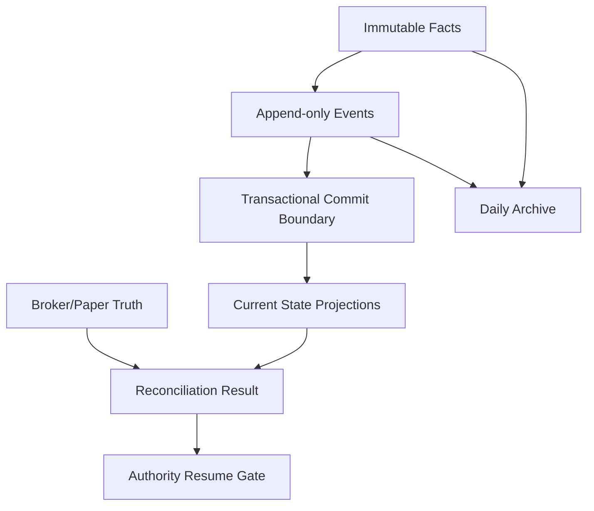

### 12.3 Persistence Classification

The machine-readable catalog is
`reports/phase3e/persistence_entity_catalog.json`.

Summary:

- `IMMUTABLE_FACT`: trading session, resolved config, plans, intents, risk
  decisions, fills, reconciliation results, evidence packets
- `APPEND_ONLY_EVENT`: order events, lifecycle requirements, kill-switch
  actions, operator actions
- `CURRENT_STATE_PROJECTION`: client orders, position cycles, protection
  generations
- `RECONSTRUCTIBLE_CACHE`: runtime checkpoints and derived snapshots
- `EXTERNAL_BROKER_TRUTH`: broker orders, broker positions, broker margins
- `ANALYTICAL_PROJECTION`: trade facts and P&L facts

### 12.4 Transaction Boundaries

Minimum atomic transactions:

| Transaction | Atomically persists | Rollback/retry behavior |
| --- | --- | --- |
| ExecutionIntent acceptance | intent, risk/account decision, idempotency reservation, current intent state | retry by intent idempotency key; conflicting duplicate rejects |
| Broker submission acknowledgement | client order projection, broker order identity, acknowledgement event, submission timestamp | if broker response is lost, reconcile before retry |
| Fill processing | fill fact, order filled quantity, position quantity change, average price, lifecycle/protection requirement, source fact reference | duplicate fill ignored by fill id; conflicting fill quarantines order |
| Protection replacement | new protection generation, old supersession state, replacement intent, expected protection projection | retry by protection generation; stale generation cannot overwrite newer one |
| Position closure | final exit fill, remaining quantity zero, terminal cycle state, trade closure fact, realized P&L inputs | duplicate close is idempotent; quantity mismatch requires reconciliation |
| EOD carry-forward | carry decision, lifecycle continuation, next-session recovery requirement, unresolved protection state | retry by position cycle/date; recovery must preserve pending requirement |

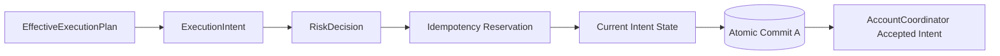


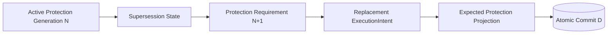

### 12.5 Idempotency Model

Idempotency keys:

- strategy evaluation: `strategy_instance_id|trading_date|config_hash|input_hash`
- plan generation: `strategy_evaluation_id|plan_hash`
- execution intent: `account_session_id|source_requirement_id|intent_hash`
- broker submission: `account_session_id|client_order_id|submit_attempt`
- order event: `client_order_id|broker_event_id_or_event_sequence`
- fill: `client_order_id|broker_fill_id_or_fill_hash`
- cancellation: `client_order_id|cancel_generation`
- replacement: `position_cycle_id|protection_type|new_generation`
- lifecycle requirement: `position_cycle_id|requirement_type|generation|hash`
- reconciliation action: `account_session_id|scope|broker_snapshot_hash|local_hash`
- trade fact: `source_event_id|fact_type|projection_version`
- PnL fact: `position_cycle_id|as_of_timestamp|input_hash|projection_version`
- operator action: `actor|scope|action_type|timestamp|action_hash`

Handling:

- duplicate identical request returns the existing result
- duplicate conflicting request is rejected and retained as evidence
- replay after timeout checks durable reservation before action
- lost broker acknowledgement triggers broker order-book reconciliation
- local commit succeeds but response is lost returns committed state on retry
- broker accepts while local process crashes enters recovery and reconciles
- duplicate fill event is ignored by fill idempotency key
- delayed broker event after restart is applied only if legal for the current
  order generation

No retry may produce a second financial action.

### 12.6 Broker Reconciliation Architecture

Inputs:

- broker orders, trades/fills, positions, margin/funds
- local intents, orders, fills, position-cycle projections
- expected active protection
- previous reconciliation results

Outputs:

- `ReconciliationResult`
- correction requirement
- block decision
- manual-review requirement
- projected state repair proposal

Scopes:

- account startup
- process restart
- periodic intraday
- after broker reconnect
- after order timeout
- after partial fill
- after replace/cancel
- before new entry
- before EOD closure
- next-day carried-position startup

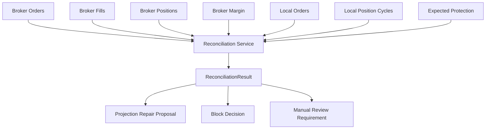

Automatic projection repair is allowed only when broker truth is complete,
identity match is unambiguous, and the repair reduces local inconsistency
without broker mutation. Manual review is always required for unknown broker
orders, duplicate protection, local-closed/broker-open conflicts, missing
broker state, and any repair that could hide exposure.

### 12.7 Reconciliation Classifications

| Classification | Fresh entry | Lifecycle | Future cancel/modify | Account status | Repair |
| --- | --- | --- | --- | --- | --- |
| `MATCHED` | allowed if other gates pass | allowed | allowed by mode | active | none |
| `BROKER_ONLY_ORDER` | blocked for affected account | review dependent position | manual review | blocked | no automatic broker mutation |
| `LOCAL_ONLY_ORDER` | blocked for affected scope | reconcile before action | no until broker query complete | degraded | mark expired only if broker proves absent |
| `BROKER_ONLY_POSITION` | blocked | lifecycle manual review | no | blocked | create projection only with explicit repair evidence |
| `LOCAL_ONLY_POSITION` | blocked | blocked unless broker confirms | no | blocked | close projection only with evidence |
| `QUANTITY_MISMATCH` | blocked | risk-reduction only after review | no | blocked | maybe, if broker truth complete |
| `AVERAGE_PRICE_MISMATCH` | allowed only if quantity matched and risk ok | allowed with P&L correction | allowed by mode | degraded | yes for accounting projection |
| `ORDER_STATUS_MISMATCH` | blocked for dependent orders | depends on status | no until resolved | degraded | maybe |
| `UNKNOWN_BROKER_ORDER` | blocked | blocked for dependent cycle | no | blocked | no |
| `MISSING_PROTECTION` | block new entries for affected strategy/account | protection-required alert | future placement only after authority | degraded | no broker mutation |
| `DUPLICATE_PROTECTION` | blocked | manual review | no | blocked | no |
| `STALE_PROTECTION` | blocked for affected cycle | replacement required after authority | no until reconciled | degraded | projection only if broker confirms |
| `PARTIAL_FILL_MISMATCH` | blocked for affected strategy/account | reconcile quantity first | no | blocked | maybe with broker fill truth |
| `CLOSED_BROKER_POSITION_LOCAL_OPEN` | allowed only after local projection repair | close local cycle | no | degraded | yes with broker evidence |
| `LOCAL_CLOSED_BROKER_OPEN` | blocked | manual review/emergency policy | no | blocked | no |
| `MARGIN_UNAVAILABLE` | blocked | protection may continue if safe | no risk-increasing actions | degraded | no |
| `BROKER_STATE_UNAVAILABLE` | blocked | read-only only | no | blocked | no |
| `MANUAL_REVIEW_REQUIRED` | blocked for affected scope | depends on review | no | blocked/degraded | no until reviewed |

Every classification retains broker snapshot hash, local projection hash,
identity scope, operator message, and repair decision.

### 12.8 Restart And Recovery Sequence

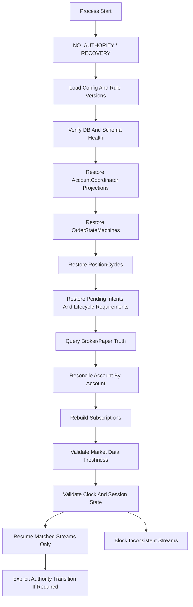

Recovery cases:

- before market: rebuild plans and reconcile carried positions first
- after market open: require coherent opening snapshot before evaluation
- between ORPT and RC: replay critical ORPT state and wait for/validate RC
- pending entry: reconcile order book before retry or expiry decision
- partial fill: process broker fills, resize protection requirement
- active SL/Target: reconcile protection order status before lifecycle action
- cancel/replace pending: query order book; do not retry blindly
- near EOD: recover in read-only mode until EOD authority gate passes
- carried positions: broker position truth first, then lifecycle requirement
- broker disconnect: account stays blocked until reconnect and reconciliation

### 12.9 Checkpoint And Replay Model

Checkpoint identity:

```text
stream_id|trading_date|checkpoint_sequence|configuration_hash|rule_matrix_version|checkpoint_hash
```

Checkpoint contents:

- event sequence watermark
- configuration hash
- rule-matrix version
- projection versions
- current order and position generations
- latest immutable snapshot hashes
- pending critical events
- checkpoint hash

Recovery method:

- order/position state: projection plus broker reconciliation
- business plans/evidence: immutable artifact reload
- runtime streams: checkpoint plus event watermark
- market data: live or replay snapshot refresh, not unlimited tick replay
- analytics: rebuild from immutable facts/events

### 12.10 Risk Control Hierarchy

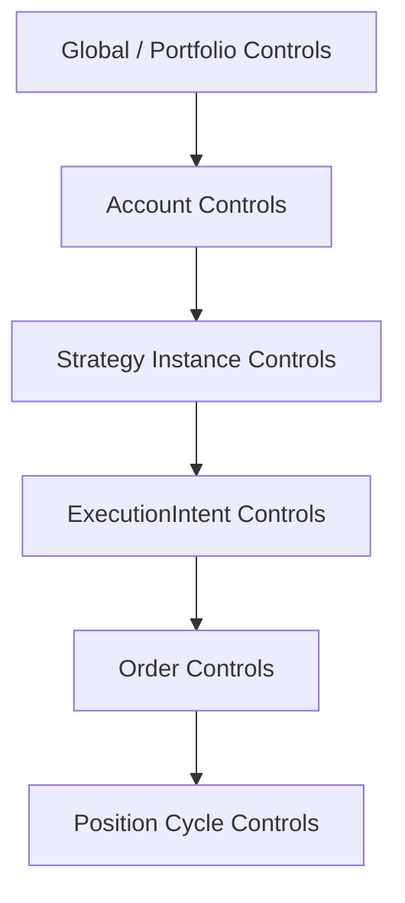

Precedence:

- higher-level block cannot be overridden below
- broker reconciliation block cannot be overridden by strategy logic
- lifecycle protection may continue when fresh entry is blocked if
  persistence, reconciliation, and authority mode allow it
- kill-switch behavior must specify whether it blocks entries, cancels working
  entries, preserves protection, reduces risk, or exits exposure

Required controls are cataloged in
`reports/phase3e/risk_control_catalog.json`.

### 12.11 Kill Switch Semantics

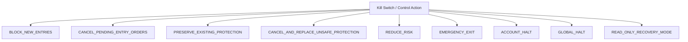

One kill switch is not one boolean. Every action must define initiating
authority, affected scope, order impact, carried-position impact, protection
handling, evidence, reset conditions, and manual approval requirements.

### 12.12 Degraded Operating Modes

```mermaid
stateDiagram-v2
    [*] --> READ_ONLY
    READ_ONLY --> RECOVERY
    RECOVERY --> SHADOW_ONLY
    SHADOW_ONLY --> PAPER_AUTHORIZED
    PAPER_AUTHORIZED --> LIVE_AUTHORIZED
    SHADOW_ONLY --> DATA_DEGRADED
    PAPER_AUTHORIZED --> DATA_DEGRADED
    PAPER_AUTHORIZED --> BROKER_DEGRADED
    PAPER_AUTHORIZED --> PERSISTENCE_DEGRADED
    PAPER_AUTHORIZED --> ACCOUNT_BLOCKED
    PAPER_AUTHORIZED --> GLOBAL_BLOCKED
    DATA_DEGRADED --> SHADOW_ONLY
    BROKER_DEGRADED --> RECOVERY
    PERSISTENCE_DEGRADED --> READ_ONLY
    ACCOUNT_BLOCKED --> RECOVERY
    GLOBAL_BLOCKED --> READ_ONLY
```

Permissions:

- `NORMAL`: all approved mode actions allowed
- `SHADOW_ONLY`: calculations and evidence only
- `PAPER_AUTHORIZED`: paper actions only after all gates pass
- `LIVE_AUTHORIZED`: separate future live approval only
- `RECOVERY`: no financial mutation; reconcile and rebuild
- `READ_ONLY`: observe and report only
- `DATA_DEGRADED`: block affected strategy/position streams
- `BROKER_DEGRADED`: block affected accounts
- `ANALYTICS_DEGRADED`: trading may continue if risk inputs remain available
- `PERSISTENCE_DEGRADED`: downgrade authority because actions cannot be durably
  recorded
- `ACCOUNT_BLOCKED`: one account isolated
- `GLOBAL_BLOCKED`: all authority blocked

### 12.13 Market-Data Performance Architecture

```mermaid
flowchart LR
    Provider[Provider Feed] --> Adapter[Provider Adapter]
    Adapter --> Normalized[Normalized Event]
    Normalized --> Owner[Instrument State Owner]
    Owner --> Snapshot[Immutable Snapshot]
    Snapshot --> Subs[Subscription Index]
    Subs --> Strategy[Strategy Streams]
    Subs --> Position[Position Streams]
```

Rules:

- normalize each provider observation once
- one mutable owner per instrument/contract
- consumers receive immutable snapshots
- ordinary quotes/OI are conflatable
- critical events are never conflated
- stale data blocks affected streams
- timestamp semantics distinguish source, effective, dispatch, and received
  times
- option-chain snapshots and OI updates have their own freshness policy
- cross-source quotes require source quality and coherent snapshot identity
- exchange-session separation is mandatory

### 12.14 Backpressure And Queue Policy

Conflatable:

- ordinary LTP refresh
- bid/ask refresh
- OI refresh
- non-critical market depth refresh

Non-conflatable:

- market open, ORPT, RC, EOD
- strategy enable/disable
- operator/risk action
- broker acknowledgement
- fill
- cancel/replace result
- reconciliation result
- position transition

Policy:

- maximum one pending ordinary update per instrument per stream
- retain latest ordinary state
- preserve critical-event order and identity
- measure dropped/conflated event count
- alert on consumer lag
- block stale snapshots at evaluation boundary

```mermaid
flowchart TD
    Event[Normalized Event] --> Class{Delivery Class}
    Class -->|Conflatable| Latest[Latest State Slot Per Instrument]
    Class -->|Critical| Queue[Critical Event Queue]
    Latest --> Snapshot[Immutable Snapshot]
    Queue --> Dispatch[Ordered Dispatch]
    Snapshot --> Eval[Evaluation Context]
    Dispatch --> Eval
    Eval --> Lag[Consumer Lag Metrics]
```

### 12.15 Coherent Snapshot Rules

A business decision must consume one immutable evaluation context. It may use:

- underlying snapshot
- selected-contract snapshot
- OI snapshot
- option-chain snapshot
- clock event

Rules:

- same trading date and exchange session
- max age per strategy/config
- max timestamp skew per evaluation type
- source quality must meet policy
- required fields are fail-closed
- missing optional fields must be recorded
- evaluation snapshot identity is hashed
- no arbitrary mutable state reads during business evaluation

### 12.16 Performance Budgets

Provisional measurable budgets are recorded in
`reports/phase3e/performance_budget_catalog.json`.

V1 scenarios:

- 10 enabled strategies
- multiple accounts
- shared underlying plus selected contracts
- ordinary quote burst
- ORPT/RC critical-event spike
- simultaneous broker fills

Budgets are design targets only until benchmarked. Later tests should include
quote bursts, duplicate fills, multi-account reconciliation, active-order
restart, projection rebuild, and persistence-latency injection.

### 12.17 Failure Isolation

The detailed matrix is recorded in
`reports/phase3e/failure_isolation_matrix.json`.

```mermaid
flowchart TD
    Failure[Failure] --> Strategy[Strategy Scope]
    Failure --> Order[Order Scope]
    Failure --> Position[Position Scope]
    Failure --> Account[Account Scope]
    Failure --> Broker[Broker/Provider Scope]
    Failure --> Global[Global Scope]
    Strategy --> Continue1[Unrelated Strategies Continue]
    Order --> Continue2[Unrelated Orders Continue]
    Position --> Continue3[Unrelated Cycles Continue]
    Account --> Continue4[Other Accounts Continue]
    Broker --> Continue5[Other Providers/Read-only Continue]
    Global --> Halt[All Authority Halted]
```

Rule: isolate to the smallest safe scope unless evidence proves broader risk.

### 12.18 Operational Observability

Before paper authority V1 must expose:

- system health: process, queue lag, snapshot freshness, database health,
  persistence lag, reconciliation health, authority mode
- account health: connection, reconciliation, margin, open orders, positions,
  rejection count, rate-limit state
- strategy health: enabled status, premarket plan, runtime state, block reason,
  latest decision, active cycle
- order health: state, broker id, quantity, filled quantity, pending action,
  last event
- position health: confirmed quantity, average entry, remaining quantity,
  active Target/SL generation, lifecycle state, carried status, unrealized P&L
- risk health: limit usage, active blocks, kill-switch state

This milestone does not design dashboards in detail.

### 12.19 Audit And Evidence Requirements

Mandatory evidence for:

- authority-mode transition
- strategy enable/disable
- configuration change
- risk block
- kill switch
- intent acceptance/rejection
- broker submission and acknowledgement
- fill
- cancel/replace
- reconciliation correction
- position closure
- carry-forward
- manual override

Every material state change must record actor/source, timestamp, rule/config
version, previous state, new state, and evidence hash.

### 12.20 PnL Reliability

P&L must use:

- broker-confirmed fills
- confirmed quantities
- brokerage/charges where available
- corrected reconciliation facts
- contract multiplier/lot size
- currency/unit rules
- realized and unrealized separation

```mermaid
flowchart LR
    Fill[Broker-confirmed Fill] --> TradeFact[TradeFact]
    Charges[Broker Charges] --> PnL[PnLFact]
    Position[PositionCycle Quantity] --> PnL
    Market[Market Mark] --> PnL
    TradeFact --> PnL
    Reconcile[Reconciliation Correction] --> TradeFact
    Reconcile --> PnL
```

Correction behavior:

- late fill creates a correction fact and rebuilds affected P&L
- revised charges update P&L projection, not original fill fact
- quantity reconciliation repairs position projection with evidence
- trade-date changes produce correction facts
- corporate action/contract adjustment requires explicit adjustment fact
- duplicate fills are removed from projection, not from immutable history

Analytical projections must be rebuildable.

### 12.21 Phase 4 Implementation Order

Recommended order:

1. Captured/replay shadow connection.
2. Broker read-only boundary.
3. Persistence foundation.
4. Reconciliation engine.
5. `ExecutionIntent` and risk validation.
6. `AccountCoordinator`.
7. `OrderStateMachine`.
8. `PositionCycle` execution integration.
9. Operational facts.
10. Essential P&L projections.

Parallelizable:

- captured/replay shadow and broker read-only interface design can begin in
  parallel
- operational observability read models can begin after persistence schemas are
  named
- P&L projection design can proceed after fill/position fact shape is stable

Strict dependencies:

- paper authority depends on persistence, reconciliation, idempotency,
  AccountCoordinator, OrderStateMachine, PositionCycle integration, and risk
  controls
- live authority depends on a later separate live gate after paper acceptance

### 12.22 User Decisions For Later Milestones

These do not block Milestone 3:

1. Preferred transactional database. Recommended default: SQLite for local V1
   paper/shadow with a schema that can migrate later.
2. Read-only broker reconciliation availability. Recommended default: require
   order book, trade/fill book, positions, and funds/margin before paper
   authority.
3. Paper source of truth. Recommended default: internal simulator until a
   broker paper facility is explicitly approved and reconciled.
4. Persistence-degraded protection behavior. Recommended default: no new
   financial mutation; preserve broker-side protection and alert.
5. Automatic projection repair scope. Recommended default: allow only
   unambiguous broker-confirmed repairs that reduce inconsistency; otherwise
   manual review.
6. Provisional limits. Recommended default: keep placeholders in config until
   paper activation, but require the controls to exist before authority.

### 12.23 Milestone 3 Acceptance Gate

Milestone 3 is acceptable when:

- every V1 state has persistence/recovery classification
- critical financial transitions have transaction boundaries
- idempotency prevents duplicate financial actions
- broker reconciliation gates resumed authority
- restart covers entries, partial fills, protection, and carried positions
- risk hierarchy and kill-switch semantics are explicit
- degraded modes distinguish fresh entry from protection
- market-data processing is bounded and selective
- critical events cannot be conflated
- coherent snapshot rules are explicit
- performance budgets are measurable
- failure isolation is defined from strategy/order/position/account/global
  scopes
- operational observability before paper authority is defined
- P&L projections are rebuildable from broker-confirmed facts
- no runtime implementation or authority is added

## 13. Milestone 4 Analytics, Accounting Facts, And Strategy Onboarding

Status: Phase 3E Milestone 4 architecture/source-review/planning.

Milestone 4 defines the minimum V1 accounting and analytics facts needed for
profitability analysis, execution-quality review, risk reporting, and future
analytics extensibility. It also defines the first-10 strategy candidate matrix
and mandatory source-first onboarding gate. No analytics service, P&L code,
dashboard, strategy config, broker integration, runtime authority, paper
authority, or live authority is added.

### 13.1 Current Analytics And P&L Audit

Observed current/reference support:

- current paper ledger rows contain S23-shaped trade identity, entry, target,
  stoploss, lifecycle status, exit/current price, gross points, and gross P&L
- reference backtest lifecycle code calculates option-selling gross points as
  entry premium minus exit premium, then applies configured cost/slippage
  assumptions in reporting
- backtest docs already define win rate, profit factor, drawdown, cost/slippage
  assumptions, and conservative same-bar stoploss behavior for S23 studies
- current dashboards and runtime status surfaces read file-backed orders,
  positions, ledgers, heartbeats, reconciliation status, and P&L summaries

Gaps:

- P&L is not yet broker-confirmed accounting truth
- charges/taxes are estimates or absent unless broker/ledger evidence exists
- current ledger P&L is option-selling specific and should not be generalized
  to option buying, futures, equity, currency, or commodity products without
  source/metadata verification
- MFE/MAE and slippage are not complete durable facts across products
- analytics projections are not yet reconstructible from V1 immutable facts
- dimensions are sometimes implied by display names or strategy codes rather
  than stable source identities

### 13.2 Accounting Truth Model

```text
broker-confirmed fills
+ contract metadata
+ charges/taxes
+ position quantity state
+ market marks
= accounting truth

accounting truth
-> TradeFact
-> PnLFact
-> analytical projections
```

Rules:

- strategy decisions do not directly define actual P&L
- actual P&L uses confirmed fills
- planned prices and actual prices remain separate
- broker charges may arrive later and require correction facts
- analytical projections are rebuildable
- analytics cannot mutate trading state

```mermaid
flowchart TD
    Fills[Broker/Paper Confirmed Fills] --> Accounting[Accounting Truth]
    Metadata[Contract Metadata] --> Accounting
    Charges[Charges And Taxes] --> Accounting
    Quantity[Position Quantity State] --> Accounting
    Marks[Market Marks] --> Accounting
    Accounting --> TradeFact[TradeFact]
    Accounting --> PnLFact[PnLFact]
    TradeFact --> Projection[Analytical Projections]
    PnLFact --> Projection
```

### 13.3 TradeFact

The immutable TradeFact contract is cataloged in
`reports/phase3e/trade_fact_catalog.json`.

Required groups:

- identity: trade fact, trade, position cycle, trading session, strategy,
  account, broker, execution plan, rule/config hashes
- instrument: exchange, product, underlying, contract, expiry, strike, option
  type, direction, lot size, multiplier, currency
- decision context: Monthly Status, branch, market references, selected
  contract evidence, fresh/carried classification, normal/gap, ORPT/RC, rule
  ids, source evidence hashes
- execution: requested and filled quantity, average entry/exit, first entry,
  final exit, fills, partial-fill status, planned prices, revised SL,
  authorized time, submission time
- lifecycle: target, Original SL, revised SL, partial exits, carry count, EOD,
  expiry, risk/operator exits, final exit reason
- performance: gross/net P&L, charges, taxes, MFE, MAE, duration, capital or
  margin, maximum open quantity, entry/exit slippage
- provenance: source fills/orders, reconciliation version, accounting version,
  correction/supersession identity

```mermaid
flowchart TD
    Decision[Decision Evidence Packet] --> TradeFact
    Intent[ExecutionIntent] --> TradeFact
    Orders[Order Events] --> TradeFact
    Fills[Fill Facts] --> TradeFact
    Lifecycle[Lifecycle Requirements] --> TradeFact
    Reconciliation[Reconciliation Results] --> TradeFact
```

### 13.4 PnLFact

The immutable PnLFact contract is cataloged in
`reports/phase3e/pnl_fact_catalog.json`.

Minimum fact types:

- `REALIZED_TRADE_PNL`
- `UNREALIZED_POSITION_PNL`
- `DAILY_ACCOUNT_PNL`
- `DAILY_STRATEGY_PNL`
- `DAILY_BROKER_PNL`
- `DAILY_INSTRUMENT_PNL`
- `DAILY_PORTFOLIO_PNL`
- `CHARGES_ADJUSTMENT`
- `RECONCILIATION_CORRECTION`

Corrections never overwrite historical facts silently. A correction creates a
new PnLFact with `supersedes_fact_id`, calculation version, source metadata
version, and evidence hash.

```mermaid
flowchart LR
    Fill[Fill Facts] --> Realized[Realized PnL]
    Position[Open Position] --> Mark[Coherent Mark Snapshot]
    Mark --> Unrealized[Unrealized PnL]
    Charges[Charges/Taxes] --> Realized
    Charges --> Unrealized
    Realized --> PnLFact[PnLFact]
    Unrealized --> PnLFact
    Correction[Late Fill / Charge / Reconciliation] --> Superseding[Superseding PnLFact]
```

### 13.5 Product P&L Units

V1 must not infer one P&L formula for every product.

Source-backed status:

- Option Selling: verified for the current S23/S21 option-selling scope; short
  option gross P&L is entry premium minus exit/mark premium times quantity and
  multiplier
- Option Buying: source available in `AB8 OB.xlsx` / `AB6 OB`; exact P&L and
  mark rules require source extraction before authority
- Futures: source available in `AB6 Fut.xlsx`; exact strategy rows, multiplier,
  and contract unit metadata require verification
- Equity: source available in `AB9 Equity.xlsx`; stock universe, side
  permission, and accounting metadata require extraction
- Currency and commodity futures: source available through futures material,
  but contract unit/multiplier/currency treatment must be verified before V1
  authority

### 13.6 Realized And Unrealized P&L

Realized P&L:

- fill-based
- weighted average cost per `PositionCycle` for V1
- supports multiple entry fills and partial exits
- remaining quantity stays open
- charges may be confirmed, imported, estimated, or unknown
- reconciliation corrections supersede projections

Unrealized P&L:

- uses confirmed remaining quantity
- uses confirmed average entry
- uses coherent mark snapshot
- records mark timestamp, source, and quality
- stale or unavailable marks produce `UNKNOWN`, not fabricated P&L
- mark policy remains a user decision before paper authority

Recommended mark default:

- risk-conservative bid/ask: short positions mark at ask, long positions mark
  at bid
- dashboard may show LTP as informational

### 13.7 Charges And Taxes

Priority:

1. broker-confirmed charges
2. contract-note or ledger import
3. configured estimate
4. unknown

Charges include brokerage, exchange transaction charges, STT/CTT, GST, stamp
duty, SEBI charges, broker-specific charges, and currency/commodity
differences. Estimated charges must be labelled estimated. Later confirmed
charges supersede estimated values.

### 13.8 Dimensions And Metrics

The metric catalog is `reports/phase3e/analytics_metric_catalog.json`.

Stable dimensions include date/week/month/session, strategy family/definition/
version/instance, account, broker, exchange, product, underlying, instrument,
contract, option type, expiry class, direction, Monthly Status, branch,
normal/gap, ORPT/RC, fresh/carried, exit reason, win/loss, and rule/config
version.

Dimensions must come from source facts, not display-name parsing.

### 13.9 Win/Loss, Drawdown, MFE/MAE

Win/loss:

- `WIN`: final net P&L above tolerance
- `LOSS`: final net P&L below negative tolerance
- `BREAKEVEN`: within tolerance
- `OPEN`: still open
- `UNKNOWN_ACCOUNTING_STATE`: fills, charges, quantity, or marks unresolved

Drawdown:

- daily closed-equity curve is authoritative for V1 risk controls
- intraday realized plus unrealized curve is analytical only unless mark
  quality is proven
- high-water mark, drawdown amount/percentage, max drawdown, and duration are
  required

MFE/MAE:

- window starts at first confirmed fill
- selected contract price is used for options
- side sign convention must be explicit
- carried positions continue across sessions when tick/mark evidence exists
- incomplete tick evidence produces partial or unknown MFE/MAE

### 13.10 Execution Quality Facts

```mermaid
flowchart LR
    Planned[Planned Price] --> Quality[Execution Quality Fact]
    Submitted[Submitted Price] --> Quality
    Ack[Acknowledged Price/Time] --> Quality
    Fill[First/Average Fill] --> Quality
    Reject[Rejection/Cancel/Replace] --> Quality
    Data[Stale Data / Broker Disconnect] --> Quality
```

Required facts include planned price, submitted price, acknowledged price,
first fill, average fill, fill latency, rejection, partial fill, cancellation,
replacement count, slippage, missed order, stale data at submission, broker
disconnect impact, and delayed protection.

### 13.11 Read Models

Minimum read models:

- system health
- account summary
- strategy summary
- open orders
- open positions
- daily P&L
- strategy-wise P&L
- account-wise P&L
- broker-wise P&L
- instrument-wise P&L
- winning and losing trades
- trade detail with decision/order/fill trace
- reconciliation issues
- risk blocks and kill switches
- normal versus gap performance
- ORPT versus RC performance
- exit-reason breakdown
- execution-quality summary

This milestone does not design frontend layouts.

### 13.12 Analytics Failure Isolation

```mermaid
flowchart TD
    Txn[Financial Transaction] --> Facts[Operational Facts Committed]
    Facts --> Async[Async Analytical Projection]
    Async --> Dashboard[Dashboard/Reports]
    Async --> Failure[Projection Failure]
    Failure --> Stale[Display Staleness/Watermark]
    Failure --> Rebuild[Rebuild From Facts]
    Failure -. no mutation .-> Trading[Trading Authority]
```

Rules:

- operational facts are committed in the financial transaction path
- analytical projections may update asynchronously
- projection failure does not mutate trading state
- accounting fact persistence failure may block authority
- dashboards display staleness and projection watermark
- no analytics query runs synchronously in order submission

### 13.13 Future Analytics Boundaries

Deferred features:

- AI trade diagnosis
- natural-language analytics
- decision graphs
- regime studies
- strategy comparison
- capital optimization
- broker execution ranking
- feature store
- research notebooks
- warehouse export

V1 preserves stable fact ids, strategy identities, evidence hashes, dimensions,
source facts, and correction chains so these can be added later without
changing trading authority.

```mermaid
flowchart LR
    Facts[Stable V1 Facts] --> ReadModels[Essential Read Models]
    Facts --> Future[Deferred Analytics Extensions]
    Future -. read only .-> Reports[Research/AI/Warehouse]
    Future -. no write .-> Trading[Trading State]
```
