# TFIS Minimum Production Architecture V1

Status: Phase 3E Milestone 1 draft.

Date: Friday, July 31, 2026

Verdict: `MILESTONE_1_SCOPE_DRAFT`

This document defines the first complete TFIS system target. It is an
implementation roadmap, not production implementation approval. No broker,
paper, live, order mutation, or position mutation authority is granted by this
document.

## 1. Milestone 1 Scope

Milestone 1 covers:

- current-state verification
- mandatory capability classification
- explicit Version 1 success definition
- explicit Version 1 exclusions
- initial implementation gap matrix

Later Phase 3E milestones will complete ownership, account/order/position
architecture, persistence, recovery, analytics, first-10 strategy sequencing,
diagrams, and final certification.

## 2. Current Verified State

The accepted platform foundation includes:

- strategy family, definition, version, instance, evaluation, and position-cycle
  identity
- generic Business Engine Framework
- immutable runtime, decision, and evidence contracts
- S23 Call-side `PreMarketStrategyPlan`
- S23 Call-side `OpeningMarketContext`
- S23 Call-side `EffectiveExecutionPlan`
- S23 fresh-entry normal and gap/recalculation offline coordination
- S23 carried-position reconciliation snapshot and lifecycle context
- target-first carried-position opening handling
- ORPT Original-SL evaluation
- RC revised FSL/TRP calculation for verified S23 Call-side rules
- 15:00 square-off/carry decision with user-clarified equality carry-forward
- deterministic offline carried-position day coordination
- M15 normalized runtime events, instrument snapshots, subscription routing,
  stream coordinators, in-memory replay/resume, and quote conflation

Authority remains:

- broker authority: `NONE`
- paper authority: `NONE`
- live authority: `NONE`
- order mutation authority: `NONE`
- position mutation authority: `NONE`

## 3. Version 1 Success Definition

The first successful end-to-end TFIS system is a safe paper-authorized system
that can run a small approved portfolio of source-verified strategies through
the complete operational path:

```text
verified configuration
-> strategy instance resolution
-> account reconciliation
-> pre-market planning
-> market/clock event coordination
-> fresh-entry or carried-position evaluation
-> execution intent
-> risk and operational validation
-> account authorization
-> broker-neutral order request
-> paper or broker adapter boundary
-> order state tracking
-> fill tracking
-> position-cycle lifecycle
-> EOD/carry-forward decision
-> restart recovery
-> realized/unrealized P&L
-> decision, execution, reconciliation, and analytics evidence
```

Version 1 must support:

- verified strategy configurations
- enabled strategy-instance resolution
- multiple logical broker accounts
- account orders and positions reconciliation
- pre-market plans
- normalized market and clock events
- fresh-entry normal and gap paths
- carried-position paths
- execution intents
- risk and operational validation
- account-specific execution routing
- order and fill tracking
- position cycles
- target, Original SL, revised SL, EOD, and carry-forward requirements
- safe restart and recovery
- realized and unrealized P&L
- complete decision and execution evidence
- essential operational and profitability analytics

## 4. What End To End Does Not Include In Version 1

Version 1 does not include:

- live-money order authority
- automated broker write routing before separate live gates
- distributed microservices
- Kafka or external event brokers
- multi-tenant SaaS infrastructure
- advanced portfolio optimization
- AI trade diagnosis
- machine-learning strategy ranking
- natural-language analytics
- full analytical warehouse
- automated strategy modification
- unverified strategy rules

## 5. Mandatory Capability Categories

Every capability in Phase 3E must use exactly one category:

- `REQUIRED_FOR_FIRST_END_TO_END_SYSTEM`
- `REQUIRED_BEFORE_PAPER_AUTHORITY`
- `REQUIRED_BEFORE_LIVE_AUTHORITY`
- `DEFERRED_EXTENSION`

No vague capability category is allowed.

## 6. Version 1 Architecture Sketch

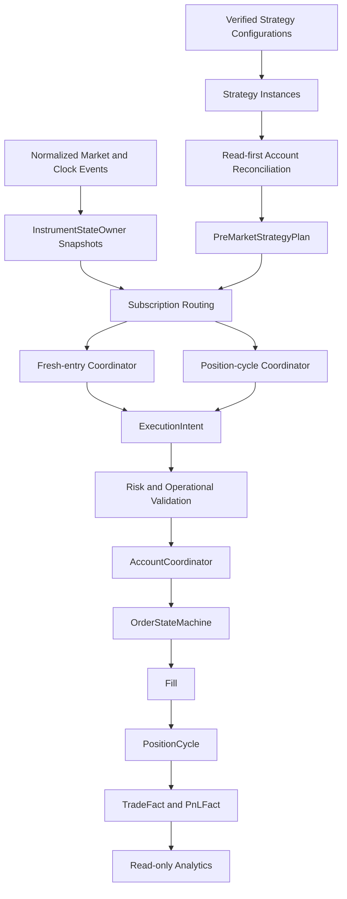

## 7. Truth Hierarchy For Version 1

The Version 1 truth hierarchy is:

```text
Market truth
-> Business-decision truth
-> Execution-intent truth
-> Broker-order truth
-> Position truth
-> Accounting/P&L truth
-> Analytical projection truth
```

Rules:

- analytics never mutates trading authority
- broker truth must be reconciled before local action
- no order or position may be identified only by strategy code or symbol
- no two components may independently mutate one order or position cycle

## 8. Initial Capability Classification

The initial classification is recorded in
`reports/phase3e/minimum_production_gap_matrix.json`.

High-level Milestone 1 decisions:

| Capability group | Category |
| --- | --- |
| Strategy identity/configuration | `REQUIRED_FOR_FIRST_END_TO_END_SYSTEM` |
| M15 runtime coordination | `REQUIRED_FOR_FIRST_END_TO_END_SYSTEM` |
| Read-first broker reconciliation | `REQUIRED_FOR_FIRST_END_TO_END_SYSTEM` |
| ExecutionIntent boundary | `REQUIRED_FOR_FIRST_END_TO_END_SYSTEM` |
| Risk and operational validation | `REQUIRED_FOR_FIRST_END_TO_END_SYSTEM` |
| AccountCoordinator | `REQUIRED_BEFORE_PAPER_AUTHORITY` |
| OrderStateMachine | `REQUIRED_BEFORE_PAPER_AUTHORITY` |
| PositionCycle execution integration | `REQUIRED_BEFORE_PAPER_AUTHORITY` |
| Reliable persistence and recovery | `REQUIRED_BEFORE_PAPER_AUTHORITY` |
| Essential P&L facts | `REQUIRED_BEFORE_PAPER_AUTHORITY` |
| Live broker write enablement | `REQUIRED_BEFORE_LIVE_AUTHORITY` |
| Advanced analytics and AI | `DEFERRED_EXTENSION` |

## 9. Milestone 1 Source Gaps

- The first-10 strategy list cannot be final until the strategy inventory is
  reviewed against workbook source and user approval.
- Option Buying, Futures, and Equity source sheets exist in
  `TFISRulesAndSpec`, but their implementation-ready normalized configs are
  not yet present in the refactored strategy registry.
- Existing paper lifecycle, order, reconciliation, and persistence code exists
  as useful reference, but must be reviewed in later milestones before being
  promoted into the new V1 architecture.
- No production persistence architecture is approved yet.
- No paper or live authority is approved.

## 10. Milestone 1 Acceptance Gate

Milestone 1 is acceptable when:

- current accepted state is verified
- Version 1 success and exclusions are explicit
- every initial capability has a mandatory category
- initial gap matrix exists and is JSON-valid
- no production code changes are made
- runtime/broker/paper/live authority remains `NONE`

## 11. Milestone 2 Domain Ownership Model

Status: Phase 3E Milestone 2 architecture/specification.

Milestone 2 defines the minimum production-grade ownership model needed before
TFIS can safely move from offline decision packets into paper-authorized order,
fill, and position-cycle tracking. It is still specification-only. It does not
grant broker, paper, live, order mutation, position mutation, persistence, or
execution authority.

### 11.1 Current Ownership Audit

The current refactored branch already has useful ingredients:

- strategy family, definition, version, instance, evaluation, and
  position-cycle identity contracts exist in `src/tfis/domain/strategy_identity.py`
- deterministic M15 runtime coordination provides in-memory single-writer
  instrument snapshots and subscription routing
- legacy paper order and position modules contain practical state and artifact
  patterns, but remain shaped by the earlier S23 paper path
- broker reconciliation helpers are read-first and useful, but current
  reconciliation keys are too coarse for V1 because provider and symbol are not
  enough to isolate account, strategy instance, position cycle, order purpose,
  and lifecycle generation

Milestone 2 therefore makes the ownership model explicit before reusing or
lifting those pieces.

### 11.2 Minimum Domain Entities

The detailed catalog is recorded in
`reports/phase3e/domain_ownership_catalog.json`.

| Entity | Purpose | Owner | Mutable | V1 category |
| --- | --- | --- | --- | --- |
| `BrokerAccountIdentity` | stable logical account key | account registry | no | `REQUIRED_FOR_FIRST_END_TO_END_SYSTEM` |
| `AccountSession` | one trading-day view of an account | `AccountCoordinator` | yes | `REQUIRED_BEFORE_PAPER_AUTHORITY` |
| `StrategyInstance` | enabled strategy/config binding | strategy resolver | no | `REQUIRED_FOR_FIRST_END_TO_END_SYSTEM` |
| `TradingSession` | date/session/time-zone boundary | runtime coordinator | no | `REQUIRED_FOR_FIRST_END_TO_END_SYSTEM` |
| `EffectiveExecutionPlan` | business plan before execution validation | business pipeline | no | `REQUIRED_FOR_FIRST_END_TO_END_SYSTEM` |
| `LifecycleRequirement` | required lifecycle protection or exit | lifecycle coordinator | no | `REQUIRED_BEFORE_PAPER_AUTHORITY` |
| `ExecutionIntent` | broker-neutral request candidate | execution-intent boundary | no | `REQUIRED_FOR_FIRST_END_TO_END_SYSTEM` |
| `ClientOrderIdentity` | TFIS-generated idempotency key | `AccountCoordinator` | no | `REQUIRED_BEFORE_PAPER_AUTHORITY` |
| `BrokerOrderIdentity` | adapter-reported order identity | broker adapter boundary | no | `REQUIRED_BEFORE_LIVE_AUTHORITY` |
| `BrokerOrder` | local projection of external order truth | `OrderStateMachine` | yes | `REQUIRED_BEFORE_PAPER_AUTHORITY` |
| `OrderEvent` | immutable order transition evidence | `OrderStateMachine` | no | `REQUIRED_BEFORE_PAPER_AUTHORITY` |
| `Fill` | immutable execution quantity/price fact | `OrderStateMachine` | no | `REQUIRED_BEFORE_PAPER_AUTHORITY` |
| `PositionCycle` | lifecycle of one trade idea/position | `PositionCycleCoordinator` | yes | `REQUIRED_BEFORE_PAPER_AUTHORITY` |
| `PositionQuantitySlice` | quantity accounting projection | `PositionCycleCoordinator` | yes | `REQUIRED_BEFORE_PAPER_AUTHORITY` |
| `ProtectionRequirement` | target/SL/FSL/TRP/MSL need | lifecycle coordinator | no | `REQUIRED_BEFORE_PAPER_AUTHORITY` |
| `ReconciliationResult` | broker/local/account comparison | `AccountCoordinator` | no | `REQUIRED_BEFORE_PAPER_AUTHORITY` |
| `RiskDecision` | per-intent risk approval/rejection | risk validator | no | `REQUIRED_BEFORE_PAPER_AUTHORITY` |
| `PortfolioControlDecision` | account/portfolio operational gate | portfolio supervisor | no | `REQUIRED_BEFORE_PAPER_AUTHORITY` |
| `TradeFact` | durable business event fact | analytics projection | no | `REQUIRED_BEFORE_PAPER_AUTHORITY` |
| `PnLFact` | realized/unrealized P&L fact | analytics projection | no | `REQUIRED_BEFORE_PAPER_AUTHORITY` |

### 11.3 Identity Traceability Chain

No V1 order, fill, position, protection, or P&L record may be keyed by strategy
code or symbol alone. The minimum chain is:

```text
BrokerAccountIdentity
-> AccountSession
-> TradingSession
-> StrategyInstance
-> StrategyDefinitionVersion
-> StrategyEvaluationIdentity
-> PositionCycleIdentity
-> EffectiveExecutionPlan
-> LifecycleRequirement or fresh-entry requirement
-> ExecutionIntent
-> ClientOrderIdentity
-> BrokerOrderIdentity
-> OrderEvent
-> Fill
-> PositionCycle
-> TradeFact
-> PnLFact
```

Every generated artifact must preserve enough of this chain to answer:

- which account owned the authority boundary
- which strategy instance produced the business requirement
- which trading session created the decision
- which position cycle was changed or protected
- which execution intent produced each order
- which broker or paper identity confirmed each order and fill
- which facts were derived from business truth, broker truth, or analytics truth

### 11.4 Truth And Ownership Hierarchy

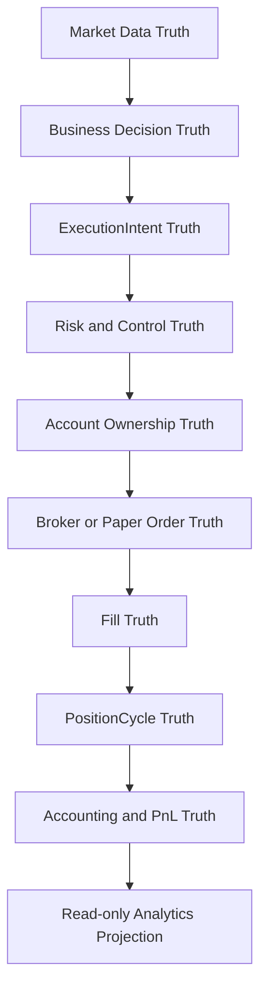

Rules:

- market data can invalidate a decision, but cannot create order authority by
  itself
- business decisions create requirements, not broker calls
- `ExecutionIntent` is the only bridge from business requirement to account
  validation
- broker or paper order truth must be reconciled before local state advances
- analytics is downstream only

### 11.5 Ownership Hierarchy

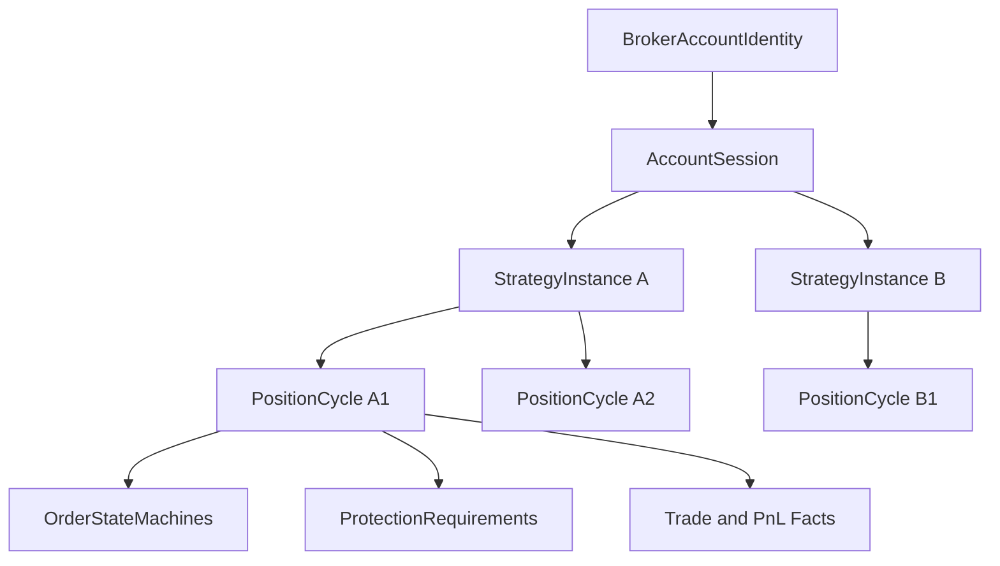

Minimum ownership rule:

- `AccountCoordinator` owns account-level acceptance and account-session
  isolation
- `OrderStateMachine` owns one client order
- `PositionCycleCoordinator` owns one position cycle
- `PortfolioRiskAndControlSupervisor` owns cross-strategy/account blocking
  decisions
- no component may mutate a child entity it does not own

### 11.6 AccountCoordinator

The `AccountCoordinator` is not a giant order manager. It is the account-level
authority gate and dispatcher.

Responsibilities:

- load account session policy
- verify account/session/strategy enablement
- consume read-first reconciliation results
- accept or reject validated `ExecutionIntent` objects
- allocate `ClientOrderIdentity`
- route accepted intents to the correct order-state owner
- isolate one account from another
- publish account-level evidence and rejection outcomes

It does not:

- calculate strategy rules
- rewrite entry, target, SL, or lifecycle formulas
- call broker SDKs directly
- own position-cycle business policy
- merge positions across accounts

### 11.7 EffectiveExecutionPlan To ExecutionIntent To BrokerOrder

```mermaid
flowchart LR
    Plan[EffectiveExecutionPlan] --> Validate[Intent Validation Pipeline]
    Validate --> Intent[ExecutionIntent]
    Intent --> Account[AccountCoordinator]
    Account --> ClientId[ClientOrderIdentity]
    ClientId --> OSM[OrderStateMachine]
    OSM --> Adapter[Broker or Paper Adapter Boundary]
    Adapter --> BrokerId[BrokerOrderIdentity]
    BrokerId --> BrokerOrder[BrokerOrder Projection]
```

The `ExecutionIntent` contract must be immutable, broker-neutral, and directly
usable by the next vertical slice.

Minimum fields:

- account identity
- trading session identity
- strategy instance and version identity
- position cycle identity or instruction to create one
- source requirement id
- order purpose
- instrument and contract identity
- side, option side where applicable, quantity, price policy, validity policy
- required protection linkage if this is an exit/protection order
- evidence packet hash
- idempotency key seed
- requested authority mode: offline, shadow, paper, or live

Forbidden fields:

- broker SDK objects
- raw broker-specific payloads
- mutable position objects
- strategy-specific string formulas
- implicit strategy-code/symbol-only keys

### 11.8 Intent Validation Pipeline

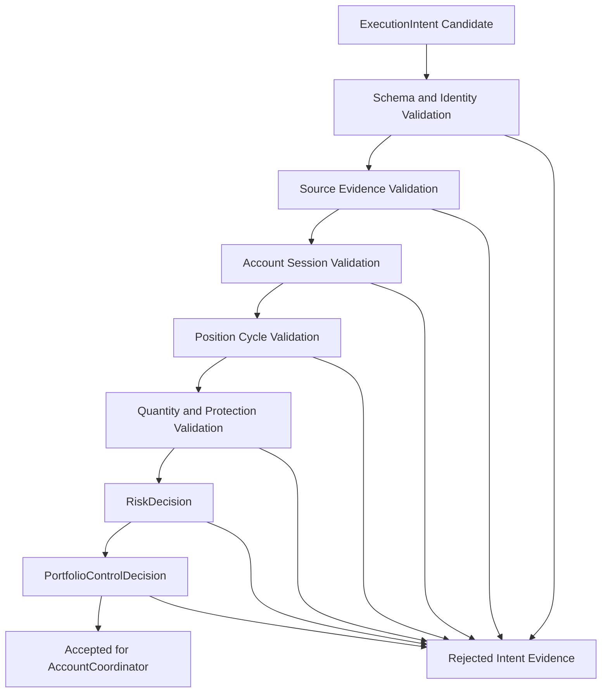

Rejection outcomes must be explicit:

- `INVALID_IDENTITY`
- `MISSING_SOURCE_EVIDENCE`
- `ACCOUNT_DISABLED`
- `STRATEGY_INSTANCE_DISABLED`
- `STALE_TRADING_SESSION`
- `POSITION_CYCLE_CONFLICT`
- `QUANTITY_INVARIANT_VIOLATION`
- `PROTECTION_INVARIANT_VIOLATION`
- `RISK_REJECTED`
- `PORTFOLIO_CONTROL_REJECTED`
- `AUTHORITY_MODE_NOT_APPROVED`
- `BROKER_CAPABILITY_UNAVAILABLE`

### 11.9 OrderStateMachine

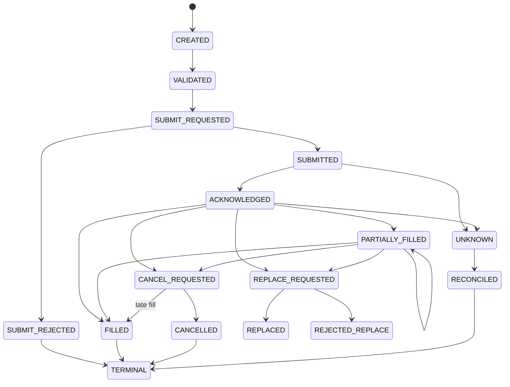

One order state machine owns one `ClientOrderIdentity`. It may attach a
`BrokerOrderIdentity` after adapter acknowledgement, but the client identity
remains the TFIS idempotency anchor.

Required edge-case handling:

- duplicate submit acknowledgement is idempotent
- partial fill before acknowledgement must be reconciled, not dropped
- fill after cancel request may still reduce remaining quantity
- cancel rejection leaves the order active unless broker truth says otherwise
- replace creates a new protection generation but must preserve old-order
  reconciliation until cancel/replace completion is proven
- unknown broker state blocks new dependent orders unless policy explicitly
  allows fail-closed replacement

### 11.10 Order Purpose And Replacement Rules

Order purpose must be typed. Minimum V1 purposes:

- `FRESH_ENTRY`
- `CARRIED_TARGET_EXIT`
- `CARRIED_ORIGINAL_SL`
- `CARRIED_REVISED_FSL`
- `CARRIED_REVISED_TRP`
- `TARGET_EXIT`
- `STOP_LOSS_EXIT`
- `EOD_SQUARE_OFF`
- `EXPIRY_FORCE_CLOSE`
- `MANUAL_OPERATOR_CLOSE`
- `PROTECTION_REPLACEMENT`

Replacement rules:

- a replacement cannot change account, strategy instance, or position cycle
- protection replacement must increment protection generation
- old and replacement orders must not jointly protect more quantity than the
  remaining open quantity unless the broker provides proven OCO semantics
- replacement rejection must leave the previous effective protection state
  visible
- stale replacement events cannot overwrite a newer protection generation

### 11.11 Fill Model

A `Fill` is immutable execution evidence. Minimum fields:

- account identity
- trading session identity
- client order identity
- broker order identity when available
- broker fill id when available
- position cycle identity
- instrument/contract identity
- side, quantity, price, fees/taxes where available
- event timestamp and broker timestamp
- source adapter
- reconciliation status

Fills mutate position-cycle projections only through the
`PositionCycleCoordinator`.

### 11.12 PositionCycle Architecture

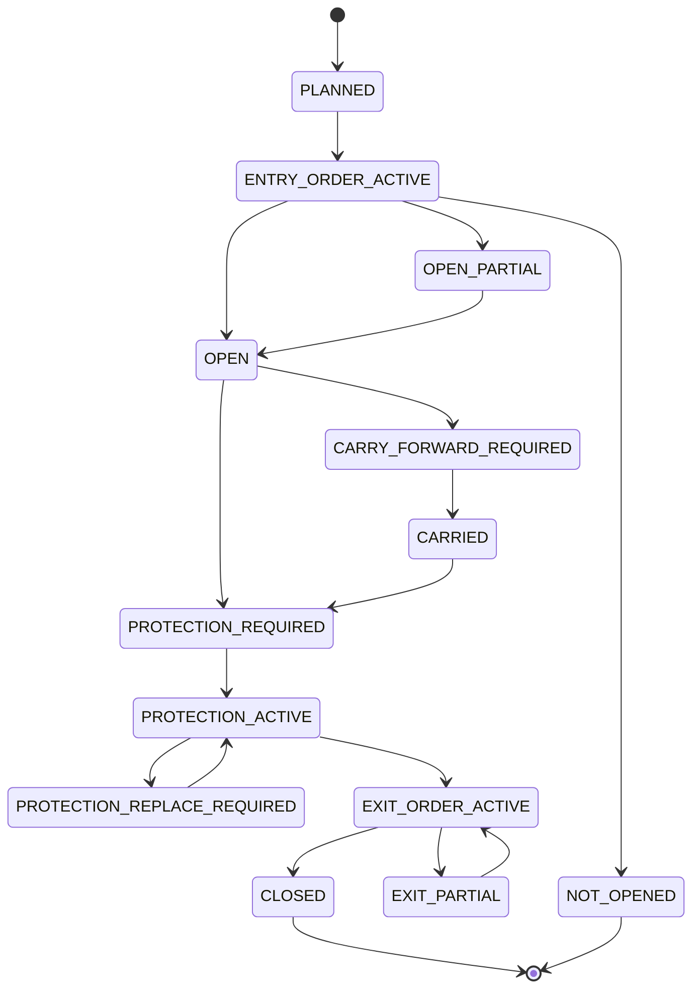

A position cycle represents one trade idea and its lifecycle, not one broker
order. One cycle may have:

- one or more entry orders
- zero or more partial fills
- multiple protection orders over time
- target exits
- stop-loss exits
- EOD square-off or carry-forward decisions
- recovery and reconciliation events

### 11.13 PositionQuantitySlice Decision

V1 should use aggregate remaining quantity plus ordered fill facts and
protection-generation records as the minimum reliable model. Explicit
lot-by-lot `PositionQuantitySlice` ownership is deferred until a source-verified
strategy requires different lifecycle policy for different filled lots.

Reason:

- the first paper-authorized system needs to prevent over-exit and
  under-protection before it needs per-lot analytics
- aggregate quantity plus fill facts can handle partial fills, partial exits,
  protection resizing, and realized P&L
- explicit slices add complexity and concurrency surface without a confirmed
  first-10 requirement

The architecture still names `PositionQuantitySlice` because the projection is
needed. In V1, it is a derived accounting projection, not an independently
mutable child object.

### 11.14 Partial Fill And Protection Resize

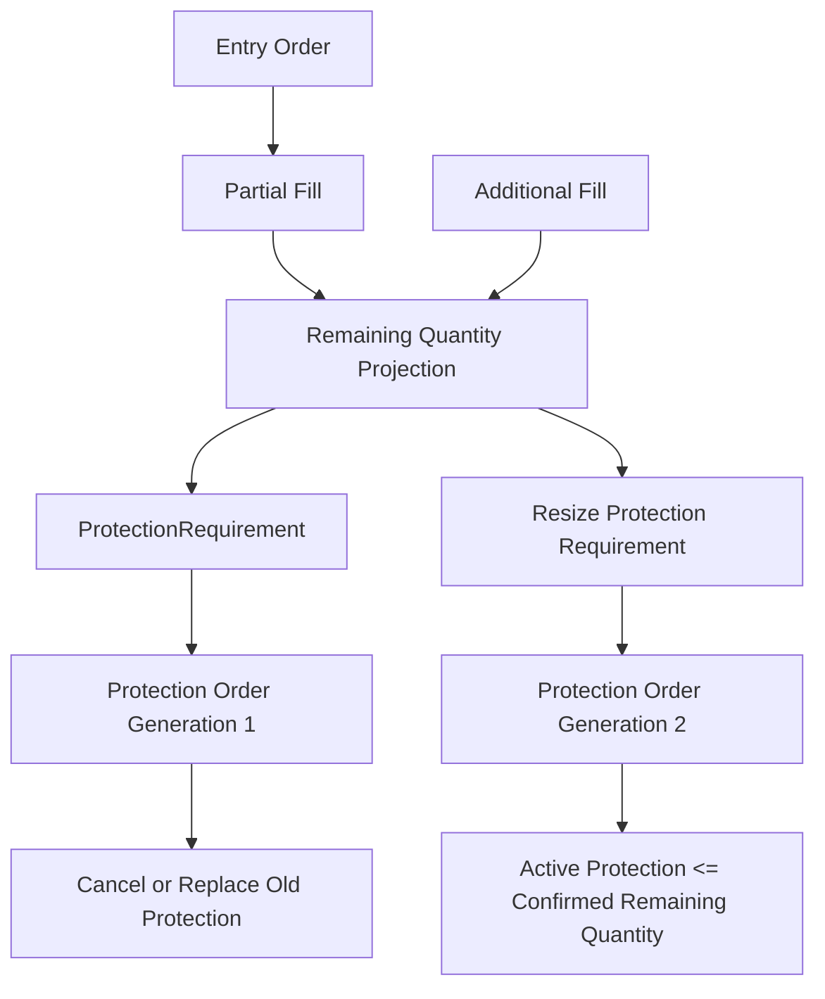

Rule: protection quantity may never exceed confirmed remaining quantity unless
the account coordinator has broker-proven OCO semantics and records the
exception as evidence.

### 11.15 LifecycleRequirement Boundary

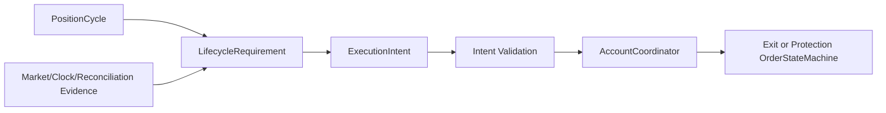

`LifecycleRequirement` is the lifecycle equivalent of an execution plan. It can
state that protection, revision, exit, square-off, or carry-forward is required,
but it does not place, modify, cancel, or mutate positions.

Minimum requirement types:

- `TARGET_PROTECTION_REQUIRED`
- `TARGET_EXIT_REQUIRED`
- `ORIGINAL_SL_PLACEMENT_REQUIRED`
- `REVISED_SL_PLACEMENT_REQUIRED`
- `REVISED_TRP_PLACEMENT_REQUIRED`
- `EOD_SQUARE_OFF_REQUIRED`
- `CARRY_FORWARD_REQUIRED`
- `EXPIRY_FORCE_CLOSE_REQUIRED`
- `NO_ACTION_REQUIRED`
- `RULE_AUTHORITY_UNRESOLVED`

### 11.16 Multiple Orders Per Position

A position cycle may own many order state machines. They are grouped by
purpose, generation, and remaining quantity.

Minimum rules:

- one active entry generation at a time unless strategy policy explicitly
  permits pyramiding
- target and SL protection must be linked to the same position-cycle generation
- exit orders reduce remaining quantity only after fill evidence
- multiple active exit orders must be quantity-capped
- stale exit/protection events cannot close a cycle after a newer reconciliation
  proves a different broker truth

### 11.17 Multiple Positions Per Strategy And Account

V1 must allow multiple position cycles per strategy instance and account, but
must default to conservative admission:

- one active fresh-entry cycle per strategy instance/product/underlying unless
  configuration explicitly allows concurrent cycles
- carried-position cycles remain separate from new fresh-entry cycles
- re-entry creates a new cycle unless an authoritative source rule says to
  extend the existing cycle
- account-level exposure checks must see all cycles for the account before
  accepting another intent

### 11.18 Multiple Account Isolation

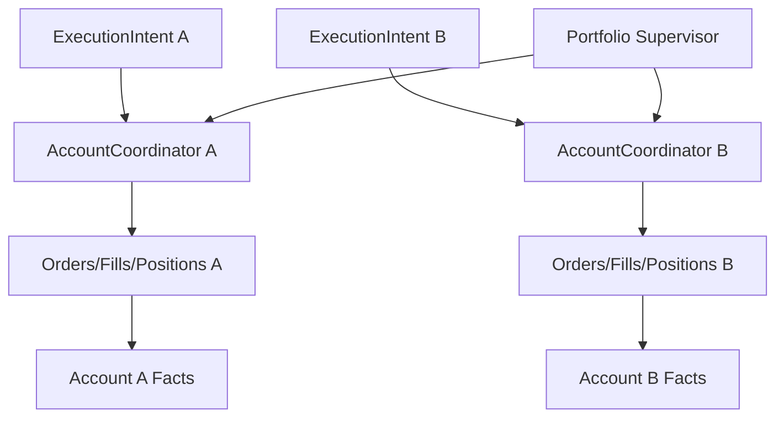

Rules:

- one account failure cannot mutate another account
- account-specific reconciliation blocks only that account unless the portfolio
  supervisor escalates a global halt
- client order identity must include account/session scope
- broker order identity is never globally unique unless the adapter proves it

### 11.19 Event Serialization And Concurrency

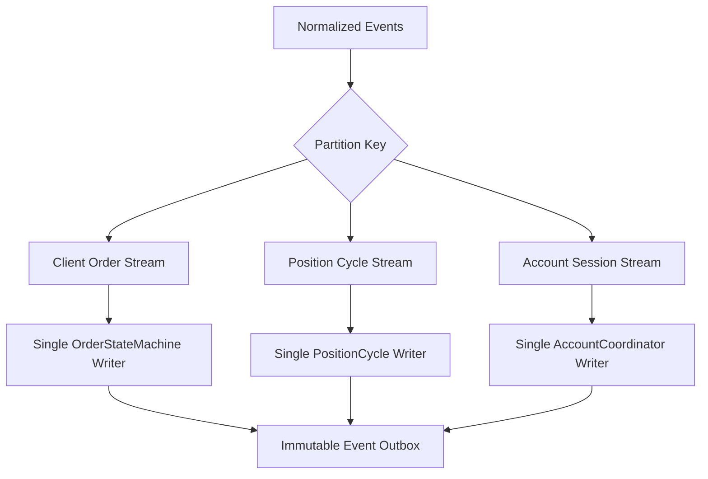

Minimum concurrency rule:

- per-entity updates are serialized by entity identity
- cross-entity workflows are coordinated through immutable events
- no shared mutable ownership between order and position owners
- derived read models may lag, but authority decisions must consume owner truth

### 11.20 Failure Isolation

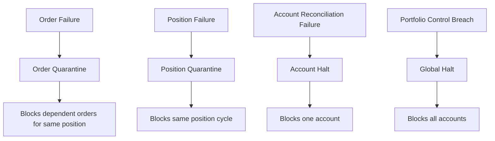

Failure scope should be the smallest safe scope:

- malformed intent: reject only that intent
- unknown order state: block dependent orders for that order/position
- reconciliation mismatch: block that account session
- strategy-rule unresolved: block affected strategy instance/cycle
- portfolio kill switch: block all account coordinators

### 11.21 Recovery Implications

Milestone 2 does not design the database, but it defines what recovery must
reconstruct:

- account sessions and last reconciliation result
- open order state machines by client order identity
- broker order identities and latest broker truth
- fills not yet projected into position cycles
- open and carried position cycles
- active protection generations
- pending lifecycle requirements
- rejected intents and unresolved authority blockers
- immutable trade and P&L fact projections

Recovery must replay facts into owners before accepting new intents.

### 11.22 Analytics Fact Connectivity

`TradeFact` and `PnLFact` are read-only downstream facts. They connect order,
fill, and position-cycle truth to analytics without granting trading authority.

Minimum facts:

- intent accepted/rejected
- order submitted/acknowledged/rejected/cancelled/replaced
- fill received
- position opened/partially opened/closed/partially closed
- target protection active
- SL/FSL/TRP protection active or missing
- EOD square-off or carry-forward decision
- realized and unrealized P&L snapshot

### 11.23 Invariants

The detailed invariant catalog is recorded in
`reports/phase3e/order_position_invariants.json`.

High-risk invariants:

- no exit or protection quantity may exceed confirmed remaining quantity
- no protection may exist for unfilled quantity
- one owner writes one order
- one owner writes one position cycle
- stale events cannot overwrite newer reconciliation truth
- closed cycles cannot accept new fills or protections except through explicit
  reconciliation correction
- broker or paper truth is read before local action
- analytics cannot drive order or position mutation

### 11.24 PortfolioRiskAndControlSupervisor

The portfolio supervisor is the cross-account control layer. It consumes
validated intents, account exposures, open cycles, pending orders, kill-switch
state, and operational readiness. It produces immutable
`PortfolioControlDecision` records.

It owns:

- global kill-switch decisions
- account-level exposure gates
- strategy-family concurrency gates
- paper/live authority mode checks
- degraded-data halt decisions
- portfolio-level rejection evidence

It does not own:

- strategy formulas
- order state transitions
- position-cycle mutation
- broker SDK calls

### 11.25 Version 1 Decisions

- `ExecutionIntent` remains minimal and broker-neutral.
- `LifecycleRequirement` remains separate from fresh-entry Gap/Missed-Entry.
- aggregate quantity plus ordered fill facts is the V1 quantity model.
- explicit slices are deferred until source-verified strategy rules require
  them.
- multiple accounts are isolated first; portfolio supervisor may only block
  broadly through explicit evidence.
- AccountCoordinator, OrderStateMachine, and PositionCycleCoordinator are
  separate owners.
- no giant `PositionManager` or `OrderManager` is approved.

### 11.26 Exact User Decisions For Later Milestones

These are not blockers for Milestone 2, but should be closed before paper
authority:

1. Should V1 allow more than one active fresh-entry cycle for the same strategy
   instance, product, and underlying, or keep the default one-active-cycle rule?
2. Is aggregate quantity plus ordered fill facts acceptable for the first paper
   authority gate, with explicit per-lot slices deferred?
3. When a broker supports OCO-like behavior, should TFIS prefer broker-hosted
   OCO or application-managed quantity caps for target/SL protection?
4. Should re-entry always create a new position cycle unless workbook evidence
   explicitly says to extend the old one?

### 11.27 Milestone 2 Acceptance Gate

Milestone 2 is acceptable when:

- ownership boundaries are explicit
- minimum domain entities are cataloged
- identity traceability is complete
- `ExecutionIntent` and `LifecycleRequirement` boundaries are broker-neutral
- order and position-cycle state machines are defined
- quantity and protection invariants are explicit
- multiple strategy, position, and account isolation rules are documented
- JSON catalogs validate
- no production source code is changed
- runtime/broker/paper/live authority remains `NONE`
