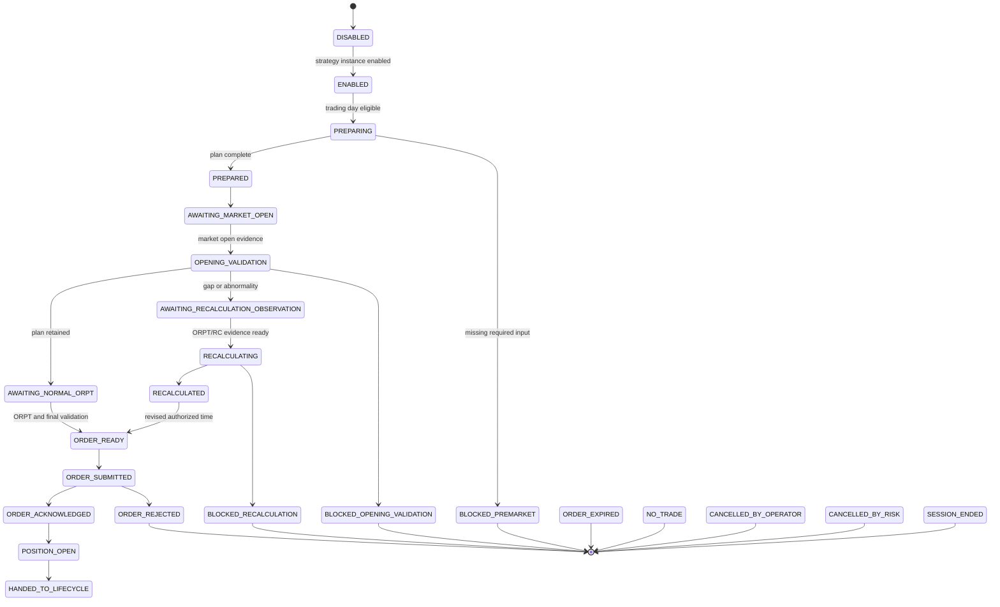
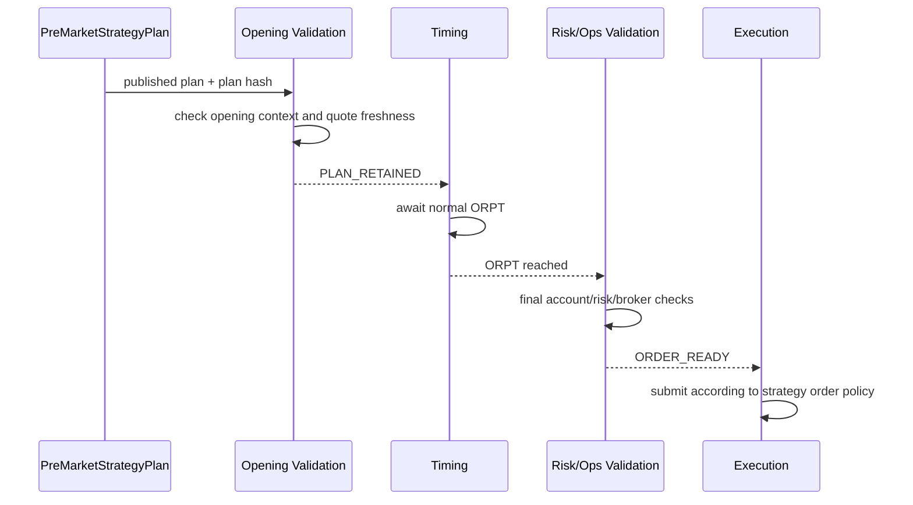
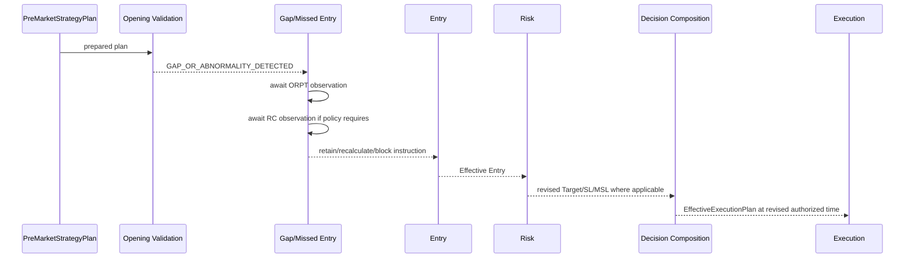
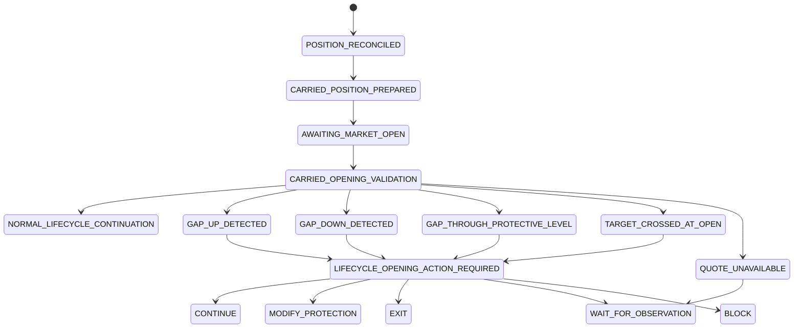
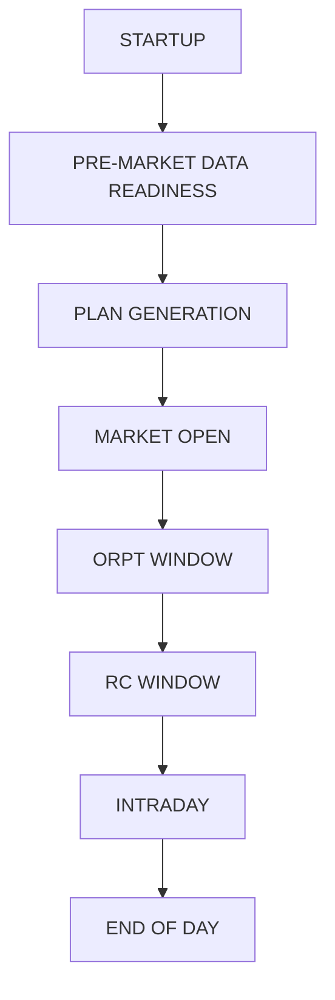
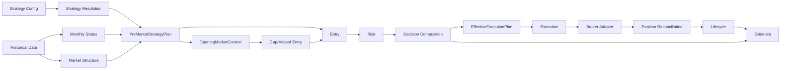
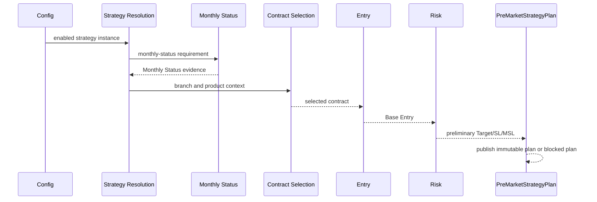
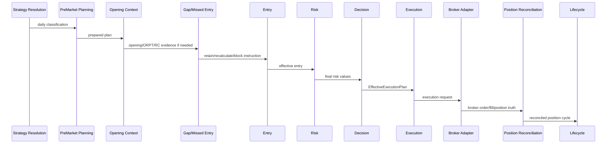

# TFIS Runtime Operational Model

Status: Phase 3D Milestone 8 specification. Runtime behavior remains
unimplemented in the refactored engine.

Date: Thursday, July 30, 2026

## 1. Purpose

This document defines the operational model future TFIS runtime work must
follow. It is an implementation contract, not a runtime implementation.

TFIS is primarily a precomputed-plan trading system. For every enabled strategy
instance, configuration and historical work should be completed before market
open wherever authoritative inputs are available. The system should enter
market open with a prepared plan, not begin discovering the complete strategy
setup from scratch after the market opens.

No runtime profile, broker path, paper authority, live authority, scheduler,
state store, order path, or lifecycle engine is implemented or activated by
this specification.

## 2. Source Map

| Runtime concept | Existing support | Status |
| --- | --- | --- |
| Strategy identity and configuration | `src/tfis/domain/strategy_identity.py` | Implemented offline |
| Runtime input and decision envelope | `src/tfis/domain/runtime_contracts.py` | Implemented contract |
| Decision evidence packet | `src/tfis/domain/decision_evidence.py` | Implemented contract |
| Business engine shell/catalog | `src/tfis/domain/business_engine.py`, Phase 3B docs | Implemented offline |
| Gap/Missed-Entry | `src/tfis/domain/gap_missed_entry.py`, `docs/architecture/tfis_phase3c_gap_missed_entry_engine.md` | Implemented offline |
| Entry | `src/tfis/domain/entry.py`, `src/tfis/entry/engine.py`, `docs/architecture/tfis_phase3d_entry_engine_contract.md` | Contract/offline shell |
| S23 Bull/Bear Call vertical slices | `src/tfis/adapters/legacy_policies/s23_vertical_slice.py` | Offline only |
| S23 capture hook | `src/tfis/adapters/legacy_policies/s23_evaluation_capture.py` | Disabled by default |
| First real session attempt | `reports/phase3d/milestone7_*` | Partial capture |
| Paper/runtime reference concepts | `src/tfis/paper/*`, read-only `D:/TradingEngineTFIS` paper/lifecycle docs | Reference/legacy support only |
| Position cycle identity | `PositionCycleIdentity` in `strategy_identity.py` | Implemented identity contract |
| Lifecycle plan contract | `LifecyclePlan` in `runtime_contracts.py` | Contract only |
| Broker/account reconciliation | existing paper/broker concepts and docs | Not wired to refactored decision authority |

Unimplemented runtime concepts are intentionally documented as gaps in the M8
gap matrix. A specification entry does not imply implementation readiness.

## 3. Temporal Model

### Pre-Market

Before market open, for each enabled strategy instance:

1. Load configuration and resolve strategy identity/version/instance.
2. Reconcile broker/account state where broker truth is available.
3. Identify carried-forward positions.
4. Recover any prior-day position-cycle continuity.
5. Load completed historical references.
6. Resolve Monthly Status and strategy branch.
7. Resolve product/instrument candidates.
8. Resolve contract-selection inputs and selected contract where possible.
9. Calculate Base Entry and preliminary Target/SL/MSL.
10. Resolve normal ORPT, RC time, and revised-time policy.
11. Produce a `PreMarketStrategyPlan`.

If required inputs are unavailable, the plan must be incomplete or
`BLOCKED_PREMARKET`; missing required values must never silently default.

### Market Open

At or after market open, TFIS consumes genuinely new session data:

- official exchange open timestamp where available
- first locally received quote timestamp
- opening underlying quote/bar
- selected-contract bid/ask/LTP
- opening OI where available
- quote freshness
- opening gap and abnormal-opening classification
- ORPT observation
- RC observation where applicable

Historical calculations are not recomputed merely because the market opened.
Current data validates, retains, revises, or blocks the prepared plan.

### Normal Fresh-Entry Path

```text
Pre-Market Strategy Plan
-> Opening Validation
-> Await Normal ORPT
-> Final Risk And Operational Validation
-> Order Ready
-> Order Submission
```

ORPT is an authorized order-placement time. It is not universally a price-touch
event. A price-triggered path exists only when a strategy rule explicitly
requires it.

### Gap/Recalculation Fresh-Entry Path

```text
Pre-Market Strategy Plan
-> Opening Gap/Abnormality Detection
-> ORPT/RC Observation
-> Gap/Missed-Entry Evaluation
-> Recalculation Or Block
-> Effective Execution Plan
-> Revised Authorized Time
-> Final Authorization
-> Order Submission
```

Gap/Missed-Entry decides retain/recalculate/block. Entry finalizes Effective
Entry. Risk policies calculate revised Target/SL/MSL where applicable.
Execution waits for the authorized time and submits only after final checks.

### Carried-Position Path

```text
Reconciled Existing Position
-> Carried Position Opening Plan
-> Opening Gap/Risk Evaluation
-> Lifecycle Action
-> Continued Management Or Exit
```

Fresh-entry gap handling and carried-position opening-risk handling are
separate business processes. A carried position must not be routed into fresh
entry planning unless an explicit authoritative re-entry rule permits it.

## 4. Core Immutable Business Objects

These objects are conceptual contracts for future implementation. They are not
Python classes in this milestone.

### 4.1 PreMarketStrategyPlan

Purpose: the immutable trading plan for one strategy instance and one trading
day, prepared before market open wherever inputs are authoritative.

Required conceptual fields:

- Identity: strategy family, definition, version, instance, resolved
  configuration hash, portfolio/account logical reference, trading date,
  plan id, plan version, plan hash.
- Eligibility: enabled state, trading-day eligibility, fresh-entry
  eligibility, carried-position status, block reason, operator/risk
  permission.
- Market context: Monthly Status, resolved branch, completed historical
  underlying references, completed historical selected-contract references,
  reference timestamps, provenance.
- Instrument resolution: product type, underlying instrument, expiry
  candidates, strike candidates, selected contract, selected expiry, selected
  strike, selected-contract provenance, premium and OI qualification.
- Planned values: Base Entry, preliminary Target, preliminary SL/MSL, order
  side, position intent, quantity/lots, normal ORPT, RC time, revised-time
  policy, Gap/Missed-Entry policy, risk policy, execution policy.
- State: `PREPARING`, `PREPARED`, `BLOCKED_PREMARKET`,
  `MANAGING_CARRIED_POSITION`, `AWAITING_MARKET_OPEN`.
- Evidence: calculation fragments, missing/derived/supplemented fields, policy
  identities, deterministic business hash.

A plan may be complete, incomplete, or blocked. A blocked plan remains useful
evidence and must state the exact blocker.

### 4.2 OpeningMarketContext

Purpose: immutable current-session evidence that becomes available only at or
after market open.

Required conceptual fields:

- trading date
- exchange/session identity
- official open timestamp where available
- first received quote timestamp
- underlying opening price
- selected-contract opening bid/ask/LTP
- opening OI where available
- quote freshness
- opening gap classification
- abnormal-opening classification
- ORPT observation
- RC observation where applicable
- source timestamps
- source provenance
- data-quality state
- carried-position opening quote where applicable

The following are distinct and must not be treated as interchangeable without
explicit policy:

- official exchange opening price
- first locally received tick
- derived opening bar
- ORPT observation
- RC observation

### 4.3 EffectiveExecutionPlan

Purpose: the final immutable plan authorized for order submission after
opening validation and any required recalculation.

It may be unchanged, revised, blocked, expired, or superseded.

Required conceptual fields:

- source `PreMarketStrategyPlan` id/hash
- `OpeningMarketContext` id/hash
- normal or recalculated path
- Effective Entry
- effective Target
- effective SL/MSL
- authorized order-placement time
- order type
- quantity
- selected contract
- final eligibility
- final decision
- no-trade/block reason
- policy identities
- downstream execution permission
- evidence packet
- effective-plan hash

This object represents trading authorization. It does not itself place an
order.

### 4.4 PositionLifecycleContext

Purpose: immutable or transition-controlled context for one executed or
reconciled position cycle.

Required conceptual fields:

- strategy instance identity
- position cycle identity
- broker/account logical reference
- instrument/contract
- side
- quantity
- average entry
- entry date
- carried-forward status
- current protective levels
- Target/MSL/SL/TSL/FSL/TRP state where authoritative
- partial-exit state
- expiry state
- opening quote
- opening gap classification
- gap-through-stop/target observation
- lifecycle action
- reconciliation state
- lifecycle evidence
- terminal state

Lifecycle owns positions after execution or reconciliation. Entry must not
manage carried positions.

## 5. Strategy-Instance Daily Classification

At startup/pre-market reconciliation, every enabled strategy instance must be
classified into exactly one primary path:

| Classification | Meaning | Next owner |
| --- | --- | --- |
| `DISABLED` | Instance is not permitted today. | Strategy Resolution |
| `BLOCKED_CONFIGURATION` | Configuration, version, or policy resolution failed. | Strategy Resolution |
| `PREPARING_FRESH_ENTRY` | No carried position; plan generation can begin. | Pre-market planning |
| `PREPARED_FRESH_ENTRY` | Plan is complete and awaits open. | Opening validation |
| `BLOCKED_PREMARKET` | Required pre-market input is missing or invalid. | Operator/risk/data recovery |
| `MANAGING_CARRIED_POSITION` | Broker reconciliation found an existing position. | Lifecycle |
| `NO_ACTION_TODAY` | Strategy is valid but not eligible today. | Evidence/operations |
| `TERMINATED_BY_OPERATOR_OR_RISK` | Operator/risk disabled activity for the day. | Operator Controls |

Rules:

- A strategy instance with an existing carried position must not automatically
  enter fresh-entry preparation.
- Re-entry requires explicit authoritative strategy permission.
- One strategy instance may not have two independently authoritative position
  cycles unless configuration explicitly permits it.
- Broker reconciliation is authoritative for actual open-position existence.
- Local state must not override broker truth without reconciliation evidence.

## 6. Fresh-Entry State Machine



| State | Owner | Entry condition | Required inputs | Permitted actions | Legal next states | Execution permitted |
| --- | --- | --- | --- | --- | --- | --- |
| `DISABLED` | Strategy Resolution | Instance disabled | Config registry | Record no-action evidence | `ENABLED`, terminal | No |
| `ENABLED` | Strategy Resolution | Instance active | Resolved identity/config | Daily eligibility check | `PREPARING`, terminal | No |
| `PREPARING` | Pre-market planning | Eligible, no carried position | History, Monthly Status, config | Build plan | `PREPARED`, `BLOCKED_PREMARKET` | No |
| `PREPARED` | Pre-market planning | Plan complete | Plan hash/evidence | Publish immutable plan | `AWAITING_MARKET_OPEN` | No |
| `AWAITING_MARKET_OPEN` | Runtime coordinator | Prepared plan exists | Market calendar | Wait | `OPENING_VALIDATION`, `SESSION_ENDED` | No |
| `OPENING_VALIDATION` | Opening validation | Opening context available | Quotes/freshness/gap inputs | Retain, recalc path, or block | `AWAITING_NORMAL_ORPT`, `AWAITING_RECALCULATION_OBSERVATION`, `BLOCKED_OPENING_VALIDATION` | No |
| `AWAITING_NORMAL_ORPT` | Timing/Execution readiness | Plan retained | ORPT time, fresh quote policy | Wait and validate | `ORDER_READY`, `NO_TRADE` | No |
| `AWAITING_RECALCULATION_OBSERVATION` | Gap/Missed Entry | Gap/abnormal path | ORPT and maybe RC evidence | Wait for observations | `RECALCULATING`, `BLOCKED_RECALCULATION` | No |
| `RECALCULATING` | Gap/Missed Entry + Entry + Risk | Recalc evidence ready | Policy, observations, base plan | Retain/revise/block | `RECALCULATED`, `BLOCKED_RECALCULATION` | No |
| `RECALCULATED` | Decision Composition | Revised plan valid | Effective Entry/Risk | Compose effective plan | `ORDER_READY`, `NO_TRADE` | No |
| `ORDER_READY` | Execution | Final validation passed | Effective plan, broker readiness | Create execution intent | `ORDER_SUBMITTED`, `CANCELLED_BY_OPERATOR`, `CANCELLED_BY_RISK`, `ORDER_EXPIRED` | Yes |
| `ORDER_SUBMITTED` | Execution/Broker Adapter | Intent sent | Broker response | Track ack/reject | `ORDER_ACKNOWLEDGED`, `ORDER_REJECTED` | Already submitted |
| `ORDER_ACKNOWLEDGED` | Execution | Broker accepted | Broker order id | Persist order evidence | `POSITION_OPEN`, `ORDER_EXPIRED` | Broker-owned |
| `POSITION_OPEN` | Position Reconciliation | Broker fill/position confirmed | Broker truth | Create/reconcile cycle | `HANDED_TO_LIFECYCLE` | Position exists |
| `HANDED_TO_LIFECYCLE` | Lifecycle | Position cycle recognized | Lifecycle context | Manage position | Lifecycle states | No fresh-entry authority |

Blocking states must emit evidence with failure code, failed owner, required
input, whether recovery is possible, and whether operator intervention is
required.

## 7. Normal Opening Path



Clarifications:

- Historical calculations are retained if still valid.
- Contract validity and quote freshness may be checked again.
- Risk/account/broker checks occur immediately before submission.
- Execution may block even when business calculations are valid.
- ORPT is an authorized order-placement time, not automatically a price-touch
  trigger.
- Order type remains strategy/configuration specific.

## 8. Gap/Recalculation Path



Values that may be recalculated, only when strategy authority permits:

- Effective Entry
- Target
- SL/MSL
- selected contract
- authorized placement time
- order eligibility

Do not assume all values are always recalculated.

## 9. Carried-Position Opening State Machine



Mandatory semantics:

- Carried positions are affected by market gaps.
- Prior-day protective levels may be crossed before a normal order can
  execute.
- Selected-contract opening quote and underlying opening context may both be
  relevant.
- Existing protective orders must be reconciled with broker state.
- Target, SL, MSL, TSL, FSL, and TRP ownership remains Lifecycle-specific.
- Fresh-entry Gap/Missed-Entry must not be reused blindly for carried
  positions.
- A shared `OpeningMarketContext` may be consumed by both fresh-entry and
  carried-position paths.
- Each path produces independent decisions and evidence.
- Any final action without workbook/reference authority is
  `RULE_AUTHORITY_UNRESOLVED`.

## 10. Setup Terminology

| Term | Definition | Generic runtime use |
| --- | --- | --- |
| `ENABLED` | The strategy instance is permitted to operate today. | Allowed |
| `PREPARED` | Required pre-market plan has been calculated. | Allowed |
| `SETUP AVAILABLE` | Optional general term: prerequisites are present. | Use sparingly |
| `SETUP FORMED` | Only for strategies with explicit post-open formation rules. | Avoid as universal state |
| `ENTRY CALCULATED` | Planned entry value exists. | Allowed |
| `ORDER READY` | Opening, timing, risk, and operational checks passed. | Allowed |
| `ORDER SUBMITTED` | Order was sent to broker. | Allowed |
| `TRADE FORMED` | Ambiguous unless defined per strategy; must state whether it means accepted order, partial fill, minimum fill, full fill, or reconciled position. | Avoid generically |
| `POSITION OPEN` | Broker-confirmed and reconciled position cycle exists. | Allowed |
| `CARRIED POSITION` | Position cycle remains open across trading-day boundary. | Allowed |

Avoid generic runtime code names based on `setup_formed`, `trade_formed`, or
`entry_hit` unless the strategy explicitly uses those semantics.

## 11. Engine Ownership Matrix

| Engine | Inputs | Outputs | Owns | Does not own | Pre-market role | Open/intraday role | Failure behavior |
| --- | --- | --- | --- | --- | --- | --- | --- |
| Market Data | Broker/feed/archive | Normalized observations | Data provenance/freshness | Strategy decisions | Prepare history | Provide open/ORPT/RC/live quotes | Mark unavailable/stale |
| Market Structure | Historical prices | Reference levels | Underlying references | Orders/positions | Complete levels | Validate current refs if needed | Fail missing references |
| Monthly Status | Historical/monthly context | Monthly Status evidence | Monthly classification | Orders | Resolve status | Validate staleness only | Fail closed if required |
| Strategy Resolution | Config/registry | Resolved instance/policies | Enablement/identity | Broker truth | Classify daily path | Operator/risk rechecks | Block config errors |
| Contract Selection | Plan refs/option chain | Selected instrument | Candidate/selection evidence | Position state | Select contract where possible | Revalidate contract/liquidity | No qualifying contract |
| Entry | Selected instrument, refs, GME result | Base/Effective Entry | Entry evidence | Contract search/lifecycle | Base Entry | Effective Entry after GME | Fail missing refs |
| Gap/Missed Entry | Opening/ORPT/RC evidence | Retain/recalc/block instruction | Gap/missed/recalc evidence | Execution/Risk/Lifecycle | Policy readiness | Evaluate opening path | Fail unresolved/missing |
| Risk | Entry/contract/strategy params | Target/SL/MSL/etc. | Risk formulas/evidence | Order submission | Preliminary risk | Revised/final risk | Block invalid risk |
| Decision Composition | Engine outputs | Decision/evidence packet | Final business decision object | Broker execution | Compose plan decision | Compose effective decision | No-trade/block |
| Execution | Effective plan, final checks | Execution intent/order request | Submission workflow | Strategy formulas | None | Submit at authorized time | Block/reject evidence |
| Broker Adapter | Execution request | Broker order/position truth | Broker API mapping | Strategy eligibility | Reconciliation source | Submit/ack/query | Broker unavailable |
| Position Reconciliation | Broker truth/local state | Reconciled position cycle | Position truth mapping | Entry formulas | Startup/open recovery | Fill/open position reconcile | Operator intervention |
| Lifecycle | Position context/quotes | Continue/modify/exit/block | Open position management | Fresh entries | Carried-position prep | Targets/stops/expiry | Fail closed for missing state |
| Evidence Capture | Completed objects/events | Capture packets/reports | Observational evidence | Authority | Optional audit | Optional audit | Never blocks unless future compliance mode |
| Operator Controls | Operator/risk commands | Allow/block/terminate | Manual authority gates | Business formulas | Startup permissions | Cancel/block/resume | Terminal/operator block |

Important boundaries:

- Monthly Status does not place orders.
- Contract Selection does not own positions.
- Entry does not manage carried positions.
- Gap/Missed Entry does not own broker execution.
- Risk formulas do not submit orders.
- Execution does not reinterpret strategy formulas.
- Broker Adapter does not decide strategy eligibility.
- Lifecycle does not prepare fresh entries.
- Evidence Capture observes but cannot influence authority.

## 12. Daily Timeline



### STARTUP

- process health
- configuration load
- broker/account reconciliation
- prior session recovery
- operator/risk permission

### PRE-MARKET DATA READINESS

- completed daily history
- Monthly Status
- market structure
- option contract history
- expiry calendar
- OI/premium inputs

### PLAN GENERATION

- enablement
- branch
- contract selection
- Base Entry
- preliminary risk
- ORPT/RC
- plan validation

### MARKET OPEN

- opening context
- gap classification
- carried-position opening evaluation
- fresh-entry opening validation

### ORPT WINDOW

- normal order authorization or ORPT observation

### RC WINDOW

- recalculation observation where applicable

### INTRADAY

- order reconciliation
- position lifecycle
- targets/stops
- re-entry only where explicitly authorized

### END OF DAY

- square-off/carry-forward decision
- open-order reconciliation
- persisted lifecycle state
- evidence closure
- next-day handoff

Exact times remain strategy and exchange configuration.

## 13. Failure And Recovery Semantics

| Failure | Fresh entry | Existing position | Operator intervention | Recalculation | Required evidence | Recovery |
| --- | --- | --- | --- | --- | --- | --- |
| Missing Monthly Status | Block | Continue lifecycle if independent | Usually yes | No | missing status provenance | load status or no-trade |
| Incomplete historical reference | Block | Continue if lifecycle refs available | Yes | No | missing ref list | reload history |
| Stale option chain | Block/revalidate | Continue if not needed | Maybe | No | chain timestamp/freshness | refresh chain |
| Missing OI | Block if required | Continue if lifecycle does not require OI | Maybe | No | OI availability | refresh/source OI |
| No qualifying contract | No-trade/block | Continue | Maybe | No | candidate rejection evidence | next expiry only if policy permits |
| Missing selected-contract history | Block | Continue if lifecycle has levels | Yes | No | missing contract refs | recover history |
| Market-open quote unavailable | Block opening validation | Lifecycle waits/blocks | Maybe | Not until quote available | quote missing timestamp | wait/refresh |
| ORPT observation unavailable | Block or wait | Separate lifecycle policy | Maybe | No | ORPT missing evidence | wait until policy cutoff |
| RC observation unavailable | Block recalculation | Separate lifecycle policy | Maybe | No | RC missing evidence | wait until policy cutoff |
| Broker disconnected | Block submission | Manage only if safe data exists; otherwise block action | Yes | Business recalc may proceed but no submit | broker status | reconnect/reconcile |
| Reconciliation mismatch | Block fresh entry | Block/require operator | Yes | No | broker/local diff | reconcile truth |
| Duplicate open position | Block fresh entry | Lifecycle must classify | Yes | No | duplicate identities | operator/risk decision |
| Capture failure | No block by default | No block by default | No | Allowed | capture diagnostic | continue; fix audit path |
| Process restart | Resume from immutable plans/events | Reconcile broker truth | Maybe | Only if evidence complete | restart provenance | recover/supersede |
| Stale prepared plan | Block/supersede | Continue lifecycle | Maybe | No | plan timestamp/hash | regenerate plan |
| Config changed after plan | Invalidate/supersede | Continue if lifecycle policy unaffected | Maybe | No | old/new config hash | regenerate plan |
| Plan hash mismatch | Block | Continue with reconciled lifecycle | Yes | No | hash mismatch | investigate/regenerate |
| Missing lifecycle state for carried position | No fresh entry | Block lifecycle action except emergency policy | Yes | No | broker position + missing local state | reconstruct lifecycle context |
| Broker-only protective order | No fresh entry | Reconcile before action | Yes | No | broker order book | map/cancel/retain by policy |
| Gap through protective level | Fresh path separate | Lifecycle action required | Usually yes if rule unresolved | Not fresh-entry GME | opening quote + protective level | apply authoritative lifecycle rule |
| Market opens with incomplete pre-market plan | Block fresh entry | Continue carried-position path | Maybe | No | incomplete plan evidence | late plan only if policy permits |

Capture failure must never block trading authority unless capture itself is
explicitly configured as a compliance requirement in a future approved mode.

## 14. Identity And State Keys

Authoritative identity chain:

```text
Strategy Family
-> Strategy Definition
-> Strategy Version
-> Strategy Instance
-> Trading Day
-> Evaluation
-> Pre-Market Plan
-> Effective Execution Plan
-> Execution Intent
-> Broker Order
-> Position Cycle
-> Lifecycle Evaluation
```

Conceptual keys:

- Plan identity: strategy instance + trading day + plan sequence + config hash.
- Evaluation identity: `StrategyEvaluationIdentity`.
- Broker reconciliation identity: broker/account logical reference + trading
  day + broker snapshot id.
- Position cycle identity: `PositionCycleIdentity` or reconciled broker
  position mapped to it.
- Carried-position continuity: prior position cycle id + current trading day +
  broker-confirmed open position.
- Replacement/revised plan identity: source plan id + revision sequence +
  reason + opening context hash.

Rules:

- A recalculated plan must reference the original pre-market plan.
- An order must reference the `EffectiveExecutionPlan`.
- A position cycle must reference the execution or reconciled broker position.
- Next-day carried state must preserve position-cycle continuity.
- Account and broker references remain explicit and opaque.
- This milestone does not implement multi-user tenancy.

## 15. Immutability And Versioning

- `PreMarketStrategyPlan` is immutable after publication.
- Recalculation creates an `EffectiveExecutionPlan` or revision; it does not
  mutate historical evidence.
- Configuration changes after plan generation invalidate or supersede the plan.
- Every material plan carries strategy/configuration version and hash.
- `OpeningMarketContext` is append-only evidence.
- Lifecycle transitions are recorded as events or controlled state revisions.
- Prior evidence remains reproducible.
- Timing diagnostics do not alter business hashes.

## 16. Component Flow



## 17. Pre-Market Fresh-Entry Sequence



## 18. Engine Ownership/Handoff Sequence



## 19. Implementation Gap Matrix Summary

The full machine-readable matrix is
`reports/phase3d/milestone8_runtime_gap_matrix.json`.

Key classifications:

- `IMPLEMENTED_AND_PROVEN`: strategy identity/configuration, decision/evidence
  contracts, Phase 3C offline Gap/Missed-Entry, S23 Call-side legacy fixture
  parity.
- `IMPLEMENTED_OFFLINE_ONLY`: S23 Bull/Bear Call vertical slices, Entry shell,
  M6 capture hook.
- `CONTRACT_ONLY`: `PreMarketStrategyPlan`, `OpeningMarketContext`,
  `EffectiveExecutionPlan`, `PositionLifecycleContext`, operational state
  machines.
- `PARTIALLY_SUPPORTED`: M7 real capture attempt, lifecycle/reference concepts.
- `RULE_AUTHORITY_UNRESOLVED`: carried-position gap actions, S23 PUT
  missed-entry authority, S21 ORPT/RC applicability.

## 20. Recommended Next Implementation Milestone

Implement only the first pre-market S23 plan builder contract for the two
accepted Call-side branches. It should produce a disabled/offline
`PreMarketStrategyPlan` artifact from resolved strategy configuration,
historical references, Monthly Status, Contract Selection compatibility, Base
Entry, preliminary Target/MSL, ORPT, and RC. It should not implement
`OpeningMarketContext`, `EffectiveExecutionPlan`, broker reconciliation,
execution, or lifecycle authority in the same milestone.
